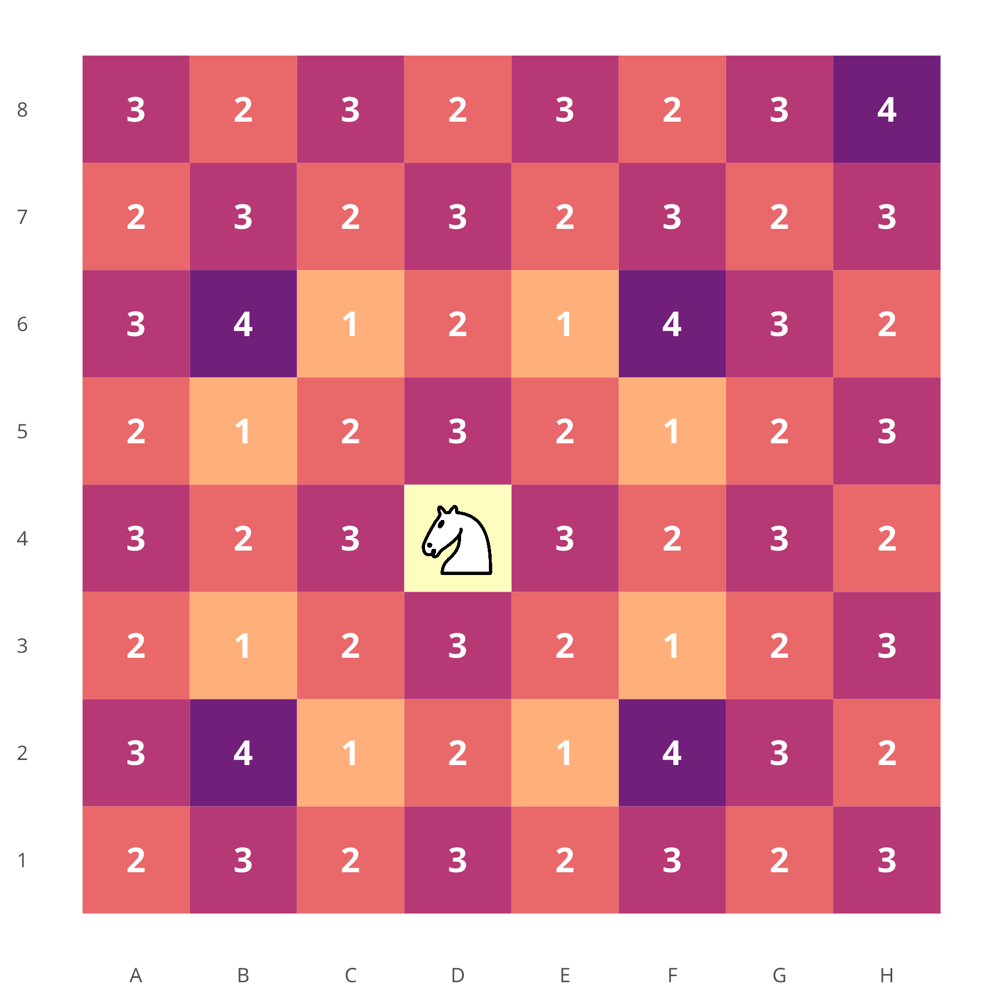
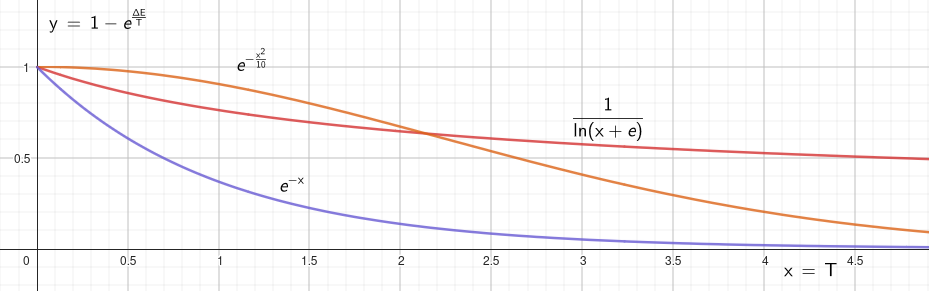
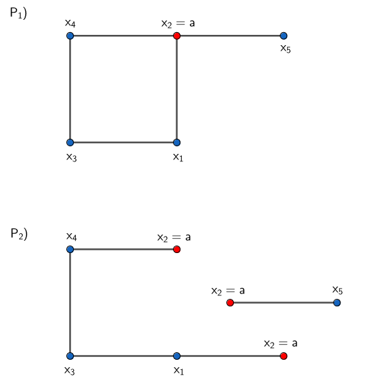
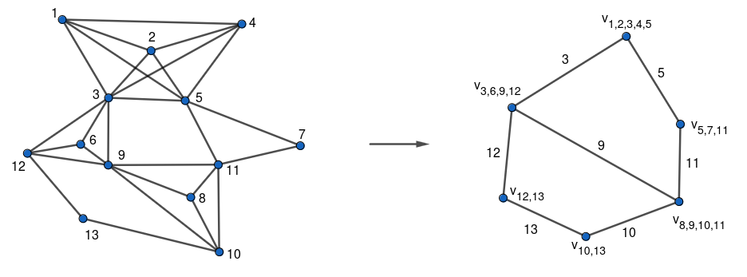
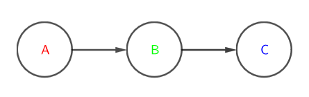
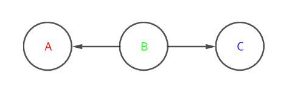
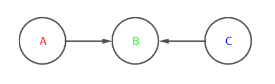
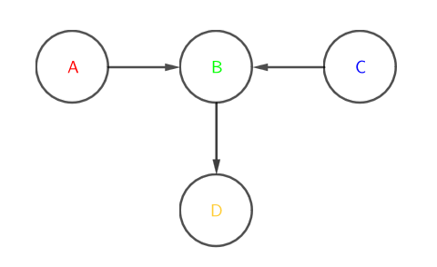

# Intelligenza Artificiale 

UNIVERSITA’ DEGLI STUDI DI FIRENZE \
Facolta di Ingegneria \
Corso di Laurea in Ingegneria Informatica \
[[B003725] Intelligenza Artificiale](https://ai.dinfo.unifi.it/teaching/ai_2023.html)
___

Professore : [Paolo Frasconi](paolo.frasconi@pm.me) \
Textbooks : [Artificial Intelligence: A Modern Approach](<!-- #TODO -->) (4th Edition) \
            [Bayesian Reasoning and Machine Learning](http://web4.cs.ucl.ac.uk/staff/D.Barber/textbook/200620.pdf)

> __Nota__: Questo documento è una raccolta di appunti personali presi durante il corso di Intelligenza Artificiale tenuto dal prof. Paolo Frasconi e sui capitoli assegnati del libro di testo. Non sono compresi gli argomenti tenuti negli articoli e _papers_ collegati e suggeriti dal professore.
___

##### Indice: <!-- #TODO -->
- [Introduzione al corso](#introduzione-al-corso)
- [Rapporto intelligenza artificiale e intelligenza umana](#rapporto-intelligenza-artificiale-e-intelligenza-umana)
- [Agente e Ambiente](#agente-e-ambiente)
- [Problemi di Ricerca](#problemi-di-ricerca)
- [Algoritmi di Ricerca](#algoritmi-di-ricerca)
- [Algoritmi di Ricerca Non Informata](#algoritmi-di-ricerca-non-informata)
- [Algoritmi di Ricerca Informata](#algoritmi-di-ricerca-informata)
- [Problemi di Ottimizzazione](#problemi-di-ottimizzazione)
- [Problemi di Soddisfacimento di Vincoli](#problemi-di-soddisfacimento-di-vincoli)
- [Finite Domain Solver](#finite-domain-solver)
- [Backtracking](#backtracking)
- [Altri approcci per risolvere CSP](#altri-approcci-per-risolvere-csp)
- [Logica](#logica)
- [Inferenza](#inferenza)
- [Incertezza](#incertezza)
- [Bayesian Network](#bayesian-network)
___

#### Introduzione al corso

Il corso corrente si concentra un alcune delle tecniche più importanti dell'Intelligenza Artificiale, con particolare attenzione alle __G.O.F.A.I.__ (Good Old Fashioned Artificial Intelligence) e alle tecniche di Machine Learning. In particolare vedremo alcune tecniche simboliche, problemi di ricerca (eg. pathfinding), problemi di soddisfacimento di vincoli, problemi di rappresentazione della conoscienza e ragionamento, ecc. Inoltre vedremo alcune tecniche di Machine Learning, come le reti neurali, le reti bayesiane, il reinforcement learning, ecc.  

Nel passato, in qualità di umani ci siamo sempre interrogati su come il nostro cervello funziona, come percepisce il mondo circostante e la natura della nostra coscienza. Con la nascita di questa nuova disciplina/campo di studio, l'intelligenza artificiale, siamo passati a porci nuovi obbiettivi, ovvero ricreare, simulare, quello che accade biologicamente nei nostri cervelli.

Il campo dell'ai è in un periodo di massimo sviluppo, investendo il mercato e le società di ricerca e sviluppo che ci investono i bilioni e dei nuovi orizzonti sono stati posti alla conoscienza umana. Mentre per i campi come la fisica o la matematica, le grandi '_scoperte_'  sono state già fatte, l'intelligenza artificiale è una disciplina ancora estremamente giovane e proliferante di innovazioni.

I campi di applicazioni sono infiniti: dalla medicina alla fisica e matematica stessa (riconoscere malattie e provare teoremi ecc.).

Cosa si intende per intelligenza? non è facile da definire, molti filosofi, ingegnieri ecc ci hanno provato dando delle definzioni diverse molti hanno definito intelligente ciò chè è razionale (vale a dire in certi termini, ciò che fa la cosa giusta). Questa definizione crea, però delle dicotomie fra ciò che è '_human-like_' e che quindi in qualche modo ammette errore e '_rational_' e che quindi è matematicamente, statisticamente corretto, fra ciò che è pensiero e ragionamento. Nelle varie branche dell' a.i. si studiano metodi, algoritmi, modelli specifici per emulare, ricreare questi aspetti dell'intelligenza. 

Ormai superato ma ancora utile a delineare alcuni aspetti delle moderne a.i. è il test proposto da Turing per rispondere alla domanda: "può un computer pensare?". Quello che realmente si salva di quel test sono le macrobranche di ricerca in campo a.i. 
Per passare il test di fatto la macchina dovrebbe passare 6 tipi di test: _natural language processing_, _knowledge rappresentation_, _automated reasoning_, _machine learning_ (nel senso di estrapolazione di pattern), _computer vision_ e _robotics_.

<!-- #TODO --> complete summary cap. 1
___

#### Rapporto intelligenza artificiale e intelligenza umana

Abbiamo brevemente introdotto il concetto di agente razionale e di razionalità, ci concentreremo ora nel definirlo meglio e vedere come questo concetto viene applicato in diversi ambiti con pochi cambiamenti.

|                    | Think | Act |
| ------------------ | ----- | --- |
|   __like Humans__  |   no  |  no |
|__with Rationality__|   no  | yes |

__Razionalità__: in termini semplici "fare la cosa giusta", vale a dire massimizzare il risultato _atteso_ ( il risultato reale può essere diverso da quello atteso, ma la scelta è stata fatta sulla base di quello che si pensava fosse il risultato migliore, ambiente potrebbe essere non deterministico o non osservabile). Il risultato atteso dipende dalla conoscenza dell'agente, dalle azioni che può eseguire e dal modo in cui le azioni influenzano lo stato del mondo, e dall'obiettivo che gli viene posto (quest ultimo in particolare non facile da modellare).

Questo modello, paradigma di razionalità, è così ampiamente accettato che viene spesso chiamato _"the standard model"_. Uno dei problemi di questo modello è che non è sempre possibile o facile allineare l'obiettivo dell'agente con quello dell'umano, questo problema è detto _"value alignment problem"_. Ad esempio se si vuole costruire un agente che deve guidare una macchina, l'obiettivo dell'agente è quello di portare il passeggero a destinazione, ma se per fare ciò deve superare un semaforo rosso, l'obiettivo dell'agente non è allineato con quello dell'umano, che è quello di non superare il semaforo rosso. Questo problema è particolarmente importante ed è causa principale dello scetticismo verso l'Intelligenza Artificiale[^1]. 

[^1]: Vedi intervista a [Geoffrey Hinton](https://youtu.be/qpoRO378qRY?si=UE93Z4cKHS5RbcRc). 

Un concetto ulteriore che non indagheremo in profondità è quello di _razionalità limitata_ che dipende quindi da tempo o risorse limitate. 
___

#### Agente e Ambiente
Definito cosa intediamo per razionalità vediamo in cosa consiste nel contesto del modello agente-ambiente. E' facile concepire che ci siano agenti che in un determinato ambiente si comportino meglio di altri, vogliamo dunque l'agente che si comporti al meglio possibile. 
Quanto effettivamente poi questo agente si comporti bene dipenderà dall'ambiente e dalle difficoltà che questi pone.

<!-- #TODO --> add image
 \
La rappresentazione non è di tipo insiemistico ma relazionale, l'agente e l'ambiente vanno sempre intesi come due entità distinte. E' tuttavia possibile che in un ambiente multiagente, un agente dipenda dagli altri e quindi li percepisca e agisca su di loro come parte dell'ambiente. 

__Agente__: qualcosa che percepisce l'ambiente tramite sensori e agisce su di esso tramite attuatori. \
__Percezione__: ciò che viene percepito dall'agente tramite sensori. \
__Sequenza di Percezioni__: la storia completa di ciò che l'agente ha percepito fino ad un certo momento \
__Funzione agente__: mappa da sequenze di percezioni a azioni (in alcuni casi anche da sequenze di percezioni a sequenze di azioni). La funzione agente è un oggetto matematico di cardinalità infinita e pertanto non implementabile fisicamente (in generale). La funzione agente determina il passaggio di stato quindi questo dipende esclusivamente dalla sequenza di percezioni e la base di conoscienze (caratteristica dei sistemi causali)e in certi casi in forma ancora più restrittiva, vale la legge di Markov, quindi il passaggio di stato dipende esclusivamente dallo stato precedente. \
__Programma agente__: implementazione fisica della funzione agente (non per mezzo di una mappa, ma tramite un algoritmo). La differenza fondamentale dalla funzione agente è che è fisico non un astrazione matematica.

Abbiamo definito lascamente che un agente razionale è l'agente che fa la cosa giusta (tralasciando il fatto che non sepre è possibile fare la cosa giusta/ non sempre si hanno le informazioni per fare la cosa giusta), proviamo ora a dare una definizione più formale.

__Misura di prestazione__: criterio che determina il successo dell'agente data una sequenza di stati dell'ambiente (quindi la desiderabilità di una certo stato dell'ambiente data una sequenza di azioni). Come introdotto precedentemente la misura di prestazione non è necessariamente ottima, ma è quella che l'agente ritiene ottima sulla base della sua conoscenza e obiettivo. Definire questa funzione obbiettivo è come stato detto in precedenza molto complesso perchè può portare l'agente a prendere decisioni inaspettate che nel peggiore dei casi potrebbero essere dannose. Di solito una buona regola per definire una misura di prestazione è definirla in accordo a ciò che si vuole ottenere piuttosto a come crediamo che l'agente dovrebbe comportarsi. \
__Agente Razionale__: agente che sceglie l'azione che massimizza la misura di prestazione, data la sequenza di percezioni fino a quel momento e la base di conoscienze. 

Bisogna distingure fra razionalità e omniscienza. Un agente omniscente conosce il reale risvolto di ogni sua azione ma spesso questo è impossibile da ottenere. Razionalità $\neq$ Perfezione. Detto ciò bisogna assicurarci di aver fatto il possibile per prendere la decisione migliore, preso azioni per modificare le pecezioni future (__Information Gathering__). Eg. prima di attraversare la strada guardare a destra e sinistra ci permette di massimizzare l'azione futura da prendere (decide se attraversare la strada o aspettare il passaggio delle macchine). Non solo l'agente deve ottenere nuove informazioni ma imparare da esse, modificando o ampliando la propria conoscenza di base. Un agente che dipende dalla propria conoscenza a priori si dice manchi di __autonomia__.

> __Domanda__: il concetto di autonomia è relativo alla conoscenza di base e ai bias che il programmatore dell'a.i. ha inserito all'interno. Lo stesso concetto puo essere applicato anche alla misura di prestazione? in altre parole può anch'essa essere soggeta a bias? e dunque c'è un modo/ esistono ai indipendenti da essa che imparano la propria misura di prestazione?

__Ambiente__: ciò che circonda l'agente, ha diverse caratteristiche che possono variare molto da problema a problema (la definizione varia quindi molto e quella che segue è informale, più simile ad una lista di caratteristiche):

<div style="position: absolute; border-left: 1px solid #000; height: 7vh; margin: 0 0;"> </div>

- __Completamente osservabile__ : l'agente può vedere lo stato dell'ambiente in ogni momento.
- __Parzialmente osservabile__ : l'agente può vedere solo una parte dello stato dell'ambiente in ogni momento.

<div style="position: absolute; border-left: 1px solid #000; height: 7vh; margin: 0 0;"> </div>

- __Agente singolo__ : un solo agente opera nell'ambiente.
- __Multiagente__ : più agenti operano nell'ambiente (in questo caso il problema può essere cooperativo o competitivo).

<div style="position: absolute; border-left: 1px solid #000; height: 7vh; margin: 0 0;"> </div>

- __Deterministico__ : l'effetto delle azioni è determinato dallo stato attuale dell'ambiente.
- __Non deterministico__ : l'effetto delle azioni è non determinato dallo stato attuale dell'ambiente.

<div style="position: absolute; border-left: 1px solid #000; height: 7vh; margin: 0 0;"> </div>

- __Episodico__ : le azioni dell'agente non dipendono dalle azioni precedenti.
- __Sequenziale__ : le azioni dell'agente dipendono dalle azioni precedenti.

<div style="position: absolute; border-left: 1px solid #000; height: 7vh; margin: 0 0;"> </div>

- __Statico__ : l'ambiente non cambia mentre l'agente sta pensando.
- __Dinamico__ : l'ambiente cambia mentre l'agente sta pensando.

<div style="position: absolute; border-left: 1px solid #000; height: 7vh; margin: 0 0;"> </div>

- __Discreto__ : l'ambiente ha un numero di stati assumibili discreto (la nozione di discreto può essere applicata anche al numero di azioni e percezioni).
- __Continuo__ : l'ambiente ha un numero di stati assumibili continuo.

<div style="position: absolute; border-left: 1px solid #000; height: 7vh; margin: 0 0;"> </div>

- __Conosciuto__ : l'agente conosce le regole dell'ambiente.
- __Sconosciuto__ : l'agente non conosce le regole dell'ambiente.
___

#### Problemi di Ricerca

Come è pressapocamente detto a volte è necessario all'agente per prendere decisioni razioniali, pianificare in anticipo le proprie azioni. Un agente di questo tipo è detto '_problem-solving agent_' (nel caso la rappresentazione dello stato dell'ambiente sia atomica, indivisbile) o '_planning agent_' (nel caso abbia sovrastrutture interne, rappresentazioni dello stato dell'ambiente) e la ricerca attuata dallo stesso è appunto detta '_search_'. Analizzeremo solo ambienti semplici: episodici, agente singolo, completamente osservabili, deterministici, statici, discreti e conosciuti. 

Una prima distinzione da fare è fra algoritmi di ricerca informati e non informati:
- __Informati__ : l'agente può stimare quanto è distante dall'obbiettivo
- __Non informati__ : altrimenti.

Le fasi di risoluzione del problema sono fondamentalmente 4:
- formulazione del goal
- formulazione del problema (ricrea un modello dell'ambiente in cui possa simulare le azioni da intraprendere)
- ricerca, appunto simula le varie azioni fino al raggiungimento dell'obbiettivo. Tale sequenza di azioni è _una_ soluzione.
- esecuzione

__Formalizzazione__:

Chiamiamo $P$ il __problema di ricerca__. \
Chiamiamo $P.S$ l'insieme degli __stati__ in cui l'ambiente può trovarsi. \
Chiamiamo $P.$ __$s_0$__ $\in P.S$ lo __stato iniziale__ da cui l'agente parte. \
Chiamiamo $P.G$ l'insieme (che ha spesso cardinalità 1) degli stati obbiettivo, dei __goals__. E' utile definire una funzione, matematicamente una mappa, booleana $P$.__IS_GOAL__(s) che dato uno stato verifica che questi appartenga a $P.G$. \
Chiamiamo $P.A$ l'insieme di tutte le possibili azioni intraprendibili dato un qualsiasi stato. \
Definiamo una funzione $P$.__ACTIONS__(s) che dato uno stato resituisce l'insieme delle possibili azioni che possono essere eseguite in __s__. \
Definiamo la funzione $P$.__RESULT__($s_i$, a), detta __funzione di transizione__, la funzione che dato lo stato __$s_i$__ $\in P.S$ e l'azione __a__ $\in P.A$ restituisce lo stato __$s_f$__ $\in P.S$ ottenuto applicando l'azione __a__ allo stato __$s_i$__. \
Definiamo una funzione $P$.__ACTION_COST__(s, a, s$' = P$.__RESULT__(s, a)) che restituisce un valore numerico indicativo del costo di esecuzione dell'azione __a__ dato lo stato __s__. 

> __Osservazione__: s$' = P$.__RESULT__(s, a) è completamente omissibile

Chiamiamo __percorso__ una sequenza di azioni, e __soluzione__ un percorso da __$s_0$__ a __g__ $\in P.G$. Diciamo che una soluzione è __ottima__ se la somma dei costi dato un percorso è minima ( la minore fra i costi di tutti i percorsi possibili ).

Lo __spazio delgi stati__ viene usato intercambiabilmente per indicare $P.S$ e il grafo con nodi $P.S$ e archi $P$.__ACTIONS__.
___

#### Algoritmi di Ricerca

Chiamiamo __algoritmo di ricerca__ un algoritmo che dato un problema di ricerca restituisce una soluzione o uno stato di _failure_. Ci sono diversi approcci per trovare una soluzione, in questo caso analizzeremo algoritmi che imporranno un __albero di ricerca__ nel grafo dello spazio degli stati che ha radice in __$s_0$__. Rispetto allo spazio delgi stati che da premessa era discreto, l'albero di ricerca può essere potenzialmente infinito anche con uno spazio finito poichè uno stesso stato potrebbe avere percorsi diversi indietro fino allo stato iniziale. L'albero di ricerca è un grafo acicilico (per definizione) ma i percorsi che definisce possono essere ciclici (_loopy paths_). Un ciclo è un caso speciale di percorso ridondante (_redundant path_). Ci sono tre approcci per affrontare questo problema: memorizzare i nodi già visitati ed evitare di riespanderli, ignorare il problema con le dovute analisi (in molti problemi il caso di ripetere un certo percorso è molto improbabile), controllare per i cicli ma non per percorsi ridondanti. <!-- #TODO --> clarify 
Chiamiamo un algoritmo ___graph search___ se evita di riespandere i nodi già visitati. \
Chiamiamo un algoritmo ___tree-like search___ se non evita di riespandere i nodi già visitati.

<figure style = "display: block; margin-left: auto; margin-right: auto; width: 50%;" >
    
    <figcaption>Se nello stato del problema non fosse rappresentato un counter per il controllo della <i>threefold repetition rule</i> l'albero di ricerca potrebbe diramarsi ripetendo all'inifinito oscillando tra due stati (se le mosse sono reversibili)</figcaption>
</figure>

Da qui in avanti se non specificato ci riferiremo a _nodi_ per intendere i _nodi_ dell'albero di ricerca.
L'insieme di nodi ottenuti dal risultato di $P$.__RESULT__($s_i$, a), $\forall$ __a__ $\in P$.__ACTIONS__($s_i$) sono detti nodi __figli__ (risultato diretto) o __successori__ (esecuzione ripetuta della funzione) di __$s_i$__, mentre __$s_i$__ è il nodo __genitore__.
Dopo l'esecuzione di _result_ __$s_i$__ si dice __espanso__.

Un nodo ottenuto dall'esecuzione di _result_ o la radice dell'albero si dice __raggiunto__.\
L'insieme di nodi non ancora espansi si dicono __frontiera__ o ___open list___ (la frontiera separa nello spazio degli stati i nodi espansi da quelli non ancora raggiunti).

L'algoritmo di ricerca più generale è la ___Best-first search___ : algoritmo di ricerca che espande il nodo che sembra più vicino al goal data una ___evaluation function___ $f$($n$). La frontiera in questo caso è implementata con una ___Priority Queue___. Questo algoritmo è un algoritmo di ricerca informata, in quanto usa una funzione di valutazione che stima la distanza dal goal. Esistono anche algoritmi di ricerca non informata, che non usano una funzione di valutazione ma che espandono i nodi in ordine di profondità o di costo.

Per misurare le performance di un algoritmo di ricerca si usano quattro parametri:
- __Completezza__ : l'algoritmo trova sempre una soluzione se esiste.
- __Ottimalità__ : l'algoritmo trova sempre la soluzione ottima se esiste.
- __Complessità spaziale__ : quanti nodi vengono memorizzati in memoria.
- __Complessità temporale__ : quanti nodi vengono generati e espansi.

Complessità spaziale e temporale sono misurate in termini di __b__ (fattore di branching, numero massimo di nodi figli di un nodo), __d__ (profondità massima dell'albero per la soluzione ottima) e __m__ (il massimo numero di azioni per un qualsiasi percorso), $||P.S||$ e $||(P.S \times P.A)||$ . 
___

#### Algoritmi di Ricerca Non Informata

<div style="float:right;margin:0 40px 60px 0" markdown="1">

</div>

- ___Breadth-first search___ : algoritmo di ricerca che espande tutti i nodi della frontiera, in ordine di profondità. La frontiera in questo caso è implementata con una ___FIFO Queue___. Analogo ad una best-first search con $f$ che restituisce la profondità del nodo. Se i costi sono uniformi la breadth-first search può fare un _early goal test_ per la proprietà di aver eplorato all'iterazione precedente di __d__ tutti i nodi a profondità __d - 1__.\
- ___Depth-first search___ : algoritmo di ricerca che espande il nodo più profondo della frontiera. La frontiera in questo caso è implementata con una ___LIFO Queue___. Analogo ad una best-first search con $f$ che restituisce la profondità del nodo con segno negativo. Solitamente implementato non come una _graph search_ ma come una _tree-like search_. Un implementazione ancora più avanzata vedremo più avanti si chiama ___backtracking search___. 
- ___Iterative deepening search___ : algoritmo di ricerca che esegue una depth-first search con limite di profondità __l__ e incrementa __l__ fino a trovare una soluzione. Completo e ottimo, ma non particolarmente efficiente. 
- ___Bidirectional search___ : algoritmo di ricerca che esegue una breadth-first search da __$s_0$__ e una da __g__ e si ferma quando le due frontiere si incontrano. Necessita di conoscere il goal ottimale e la funzione inversa di transizione. 

<details>
    <summary><b>Code</b>: Tree search</summary>

```python

    def tree_search(problem, frontier, depth = -1):
    frontier.append(node(problem.s_0))
    while frontier:
        node = frontier.pop()
        if problem.is_goal(node.s):
            return node
        if depth != -1 and node.g < depth:
            for action in problem.actions(node.s):
                # we are considering the path cost to be 1 for all actions -> child.g = parent.g + 1
                child = node(problem.result(node.s, action), node, action, node.g + 1) 
                frontier.append(child)
    return None
```

[See full python implementations for search problems](./algorithms/search_problems.py)
</details> 

<br>

||__Breadth-first__|__Uniform cost__$^3$|__Depth-first__|__Depth-limited__|__Iterative deepening__|__Bidirectional__$^4$|
|---|---|---|---|---|---|---|
|__Completezza__|✓$^1$|✓$^{1,2}$|✗|✗|✓$^1$|✓$^1$|
|__Ottimalità__|✓$^3$|✓|✗|✗|✓$^3$|✓$^{3,4}$|
|__Tempo__|$O(b^d)$|$O(b^{1 + \lfloor C^*/\epsilon \rfloor})$|$O(b^m)$|$O(b^l)$|$O(b^d)$|$O(b^{d/2})$|
|__Spazio__|$O(b^d)$|$O(b^{1 + \lfloor C^*/\epsilon \rfloor})$|$O(bm)$|$O(bl)$|$O(bd)$|$O(b^{d/2})$|

1. Se b è finito e se lo spazio degli stati ha soluzione o è finito.
2. Se tutti i costi sono maggiori di un certo valore $\epsilon > 0$.
3. Se tutti i costi sono uguali.
4. Se si conosce il goal ottimale e si conosce la funzione inversa di transizione.
____

#### Algoritmi di Ricerca Informata

Abbiamo già introdotto il concetto di algoritmo di ricerca informata, ovvero un algoritmo che usa una funzione di valutazione che stima la distanza dal goal. Questa funzione è detta ___heuristic function___ e viene indicata con $h$($n$). Una funzione euristica è una funzione che stima il costo minimo del percorso dal nodo $n$ al goal.

Eg.
- ___Greedy best-first search___ : algoritmo di ricerca che espande il nodo che sembra più vicino al goal data una ___evaluation function___ $f$($n$) = $h$($n$). E' completo per spazi di ricerca finiti, ma non per spazi infiniti. 
- ___A* search___ : algoritmo di ricerca che espande il nodo data una ___evaluation function___ $f$($n$) = $g$($n$) + $h$($n$) dove $g$($n$) è il costo del percorso dal nodo iniziale al nodo $n$ mentre $h$($n$) è la funzione euristica precedentemente descritta. Quindi $f$($n$) è una stima del costo del percorso dal nodo iniziale al goal passando per $n$. E' completo e ottimo se $h$($n$) è ammissibile.

___admissible heuristic___ : una funzione euristica $h$($n$) è ammissibile se $h$($n$) non sovrastima mai il costo del percorso dal nodo $n$ al goal. Ovvero se $h$($n$) $\leq$ $h^*$($n$) dove $h^*$($n$) è il costo del percorso minimo dal nodo $n$ al goal.

<details>
    <summary><b>Theorem</b>: A<sup>*</sup> è ottimo se h(n) è ammissibile </summary> 

> __Proof__: Supponiamo per assurdo che se $C^*$ il costo del percorso ottimo dal nodo $s_0$ al goal ottimale, e $f(n)$ il costo del percorso stimato dalla funzione euristica $h$($n$). Allora $f(n) > C^*$. Allora  ci deve essere un nodo che è nel percorso ottimale e non è stato espanso. Chiamiamo quindi $g^*$($n$) il costo del percorso ottimo dal nodo $s_0$ a $n$ e $h^*$($n$) il costo del percorso ottimo da $n$ al goal ottimale. Allora noi abbiamo affermato che $f(n) > C^*$
> $f(n) = g(n) + h(n) = g^*(n) + h(n)$ perchè n si trova sul percorso ottimo
> $f(n) \leq g^*(n) + h^*(n)$ per la definizione di funzione euristica ammissibile
> $\implies f(n) \leq C^*$ che contradice l'ipotesi iniziale. Quindi $f(n) \leq C^*$ e quindi A* è ottimo.

</details>

<br>

___consistent heutistic___ : una funzione euristica $h$($n$) è consistente se $h$($n$) $\leq$ $P$.__ACTION_COST__($n$, $a$) + $h$($n'$) dove $n'$ = $P$.__RESULT__($n$, $a$) $\forall n, n' \in P.S$.

Tutte le funzioni euristiche consistenti sono ammissibili. Una funzione euristica ammissibile non è necessariamente consistente. Una funzione euristica consistente è detta anche ___monotonic___ (poichè monotona crescente).
$f(n') = g(n') + h(n') = g(n) + P$.__ACTION_COST__($n$, $a$) + $h(n') \geq g(n) + P$.__ACTION_COST__($n$, $a$) + $h(n) = f(n)$


Un modo per caratterizzare la qualità di una funzione euristica è l'___effective branching factor___ $b^*$. Se il numero totale di nodi generati è $N$ e la profondità della soluzione ottima è $d$ allora $b^*$ è il fattore di branching che avrebbe un albero di ricerca completo con $N$ nodi e profondità $d$ per contenere $N+1$ nodi. $N+1 = 1 + b^* + (b^*)^2 + ... + (b^*)^d = \frac{(b^*)^{d+1} - 1}{b^* - 1}$. 
Chiamiamo ___prenetance___ $p = \frac{d}{N}$ il grado di prenetazione nell'albero. La prenetance assume valori compresi fra 0 e 1, maggiore è $p$ più è 'efficiente' $h$. 
Se un euristica $h_1$ è migliore ($\geq$) di un euristica $h_2 \forall n \in P.S$ allora diciamo che $h_1$ __domina__ $h_2$. Un modo di costruire una funzione euristica è di rilassare il problema creando un supergrafo di $P.S$ e definendo una funzione euristica su questo supergrafo.
Date due euristiche possiamo sempre costruirne una migliore prendendo il massimo dei due valori $h(n) = $ max{$h_1(n), h_2(n), \dots, h_k(n)$}. 
Un euristica più informata esplora un sottoinsieme dei nodi esplorati da un euristica meno informata.

<details>
    <summary> <b>Example</b>: Euristica per un percoso di un cavallo </summary>

> __Problema__: data una scacchiera di dimensione $n \times m$ (non necessariamente finita) trovare un percorso per un cavallo che da $s_0$ arrivi a $g$. 

<div style="float:left;margin:0 20px 0 0" markdown="1">

</div>

__Euristiche ammissibili__:
- $h_1(n) = h_{\text{Manhattab Dist.}}(n) / 3$ 
    Il cavallo si muove di 3 caselle alla volta, quindi il numero di mosse necessarie per arrivare al goal è almeno la distanza di Manhattan diviso 3.
- $h_2(n) = \begin{cases} \lceil h_1(n) \rceil \text{ se } \lfloor h_1(n) \rfloor \text{mod } 2 = 1 \\ \lfloor h_1(n) \rfloor \text{ se } \text{ se } \lfloor h_1(n) \rfloor \text{mod } 2 = 0 \end{cases}$
    Possiamo dire che $h_2 = h_1$ arrotondato con parità 'corretta', in questo caso teniamo conto che il cavallo si muove in modo alternato su caselle bianche e nere. 
- $h_3(n) = \text{max (} \frac{\lceil g_x - s_{0x} \rceil}{2}, \frac{\lceil g_y - s_{0y} \rceil}{2}$)
    Il cavallo si muove di 2 caselle in una direzione e 1 in un'altra, quindi il numero di mosse necessarie per arrivare al goal è almeno la distanza di Manhattan diviso 2.
</details>

<br>

Un idea molto simile a quella appena analizzata l'abbiamo vista nel corso di Algoritmi e Strutture dati, ovvero il concetto di ___dynamic programming___, quello che possiamo fare infatti anche con le euristiche, è di definire una funzione euristica $h$($n$) come la soluzione ottima di un sottoproblema di $P$ che ha come stato iniziale $n$. Questo è possibile se il problema $P$ ha la proprietà di ___optimal substructure___, ovvero se la soluzione ottima di un problema è composta dalle soluzioni ottime dei suoi sottoproblemi. Nell'ambito dell'ai è detto ___pattern database___. 

<!-- #TODO --> add landmark heuristic

<div style="float:left;margin:0 20px 0 0" markdown="1">

</div>

<!-- #TODO --> fix image

Un idea per limitare lo spazio di memorida occupata da un algoritmo di ricerca è mettere un limite alla dimensione massima alla coda con priorità (la frontiera). Un nuovo nodo viene inserito nella coda solo se il suo valore di priorità è maggiore del valore di priorità del nodo con valore minore. Questo algoritmo è detto ___Beam search___.
- Perde l'ottimalità (perchè potrebbe aver 'scartato' una 'scorciatoia')
- Perde la completezza (perchè potrebbe non trovare una soluzione anche se esiste, non esplorando tutti gli stati)
___

#### Problemi di Ottimizzazione

Rispetto alla classe di problemi di ricerca in cui eravamo interessati al percorso per arrivare al goal, in questo caso siamo interessati al trovare il goal ottimale. Questo tipo di problemi sono detti ___problemi di ottimizzazione___.

<details>
    <summary> <b>Example</b>: Problema delle n-regine (solitamente n = 8) </summary>

> __Problema__: dato un scacchiera di dimensione $n \times m$ trovare una disposizione delle min($n$,$m$) regine dello stesso colore tale che nessuna regina possa mangiare (stia minacciando) un'altra regina (solitamente n = m, useremo questa condizione nelle considerazioni successive). Il problema ammette soluzione solo per $n \geq 4$ o $n = 1$ (anche $n = 0$ in teoria potrebbe essere considerato con soluzione).


In questo caso utilizzare un algoritmo di ricerca non è efficiente (ragioni matematiche motivate successivamente). Il motivo intuitivo però è come detto precedentemente che non ci interessa il percorso per arrivare al goal ma il goal stesso (ovvero la configurazione delle regine). Ciascuna permutazione di mosse (piazzare una regina) per arrivare a tale configurazione è una soluzione valida e quindi le diramazioni sono molte e non ci interessa esplorarle tutte. E' evidente che non è possibile usare la ricerca bidirezionale in questo caso, perchè non si conosce il goal ottimale.

La risoluzione di questo problema può essere affrontata usando diversi tipi di algoritmi, quelli che non tengono conto del percorso ma solo dei nodi adiacenti sono detti ___local searches___ mentre il problema è detto ___optimization problem___.
Le local searches hanno il vantaggio notevole di non richiedere molto spazio di memoria ($O(1)$, poichè la frontiera è costante).

</details>

<br>

La funzione che vogliamo ottimizzare è detta ___objective function___ e viene indicata con $f$($n$). Vogliamo quindi trovare il massimo globale di $f$($n$) per $n \in P.S$. Chiamiamo questo processo ___hill climbing___. Se la funzione obiettivo è una funzione di costo vogliamo trovare invece il minimo globale. Chiamiamo questo processo ___gradient descent___.

__Hill Climbing__ : 


Facendo riferimento al problema d'esempio possiamo porre come funzione obiettivo come l'opposto del numero di regine che minacciano un'altra regina. Per muoverci da uno stato all'altro seguiamo lo stato che migliora maggiormente la funzione obiettivo. Quando non ci sono più stati che migliorano la funzione obiettivo siamo arrivati ad un massimo locale è un probabile goal, per questo motivo non è completo, trovato un massimo locale si ferma senza cercare l'effettiva soluzione ottima. Questo algoritmo è a volte detto ___greedy local search___. Altre ragioni che potrebbero portare ad un massimo locale sono la presenza di un ___plateau___ (ovvero un insieme di stati adiacenti che hanno tutti la stessa funzione obiettivo) o un ___ridge___ (ovvero un insieme di stati relativamente vicini, tutti massimi locali).

<details>
    <summary><b>Code</b>: Hill Climbing</summary>

```python

    def hill_climbing(problem, f):
        current = node(problem.s_0)
        while True:
            neighbors = [node(problem.result(current.s, action)) for action in problem.actions(current.s)]
            if not neighbors:
                return current
            neighbor = max(neighbors, key = lambda n: f(n))
            if f(neighbor) <= f(current):
                return current
            current = neighbor

```

<!-- #TODO --> add actual code link (implementation)
</details> 

<br>

Se $P.S$ è finito l'algoritmo può essere reso completo con imponendo dei _random restartes_ (ovvero ripartire da un nodo casuale) o _random walk_ (ovvero scegliere un nodo casuale ad ogni iterazione). Questi algoritmi sono detti ___stochastic hill climbing___.

__Local Beam Search__ :

Nonostante il nome non è in relazione con la beam search, ma è un algoritmo di ricerca locale che mantiene $k$ stati in memoria (rispetto al singolo stato dell' hill climbing search). L'algoritmo inizia con $k$ stati casuali (in questo fondamentalmente analogo alla random restartes search) con la proprietà che questi $k$ stati possono 'comunicare' fra loro (diverso da random restartes searches, simile ad alcuni algoritmi di ricerca genetica). Ad ogni iterazione l'algoritmo seleziona i $k$ successori migliori fra i $k$ stati attuali. Se uno di questi stati è il goal allora l'algoritmo termina, altrimenti si ripete il processo. Se non ci sono stati migliori se ne prende uno a caso come per lo stochastic hill climbing. Queste scelte sono dette ___side ways moves___ e hanno l'obbiettivo di ovviare al problema dei plateau. Non risolvono il problema dei massimi locali/relativi perchè all'iterazione successiva si ritorna allo stato di massimo locale. Per questo motivo è necessario limiare il numero massimo di side ways moves, perchè finire in un massimo locale causa un loop infinito.

Data la natura dell'algoritmo è facilmente implementabile in parallelo, velocizzando l'esecuzione. 

La local beam search può soffrire la mancanza di diversità fra i $k$ stati rendendo la ricerca una versione poco più lenta di una hillclimbind search $k$ volte più lenta.

__Simulated Annealing__ :

Il principio alla base di questo algoritmo è ispirato dalle tecniche di temperaggio usate in metallurgia. Si diminuisce 'l'entropia termica' passando da una scelta causale a una sempre più pesata verso la scelta migliore (almeno secondo la funzione obiettivo). 

> __Osservazione__: legge di Boltzmann $P(s) = \frac{1}{z}e^{-\frac{E(s)}{kT}}$ dove $P$ è la probabilità di un certo stato, $E$ è l'energia del sistema dato lo stato, $k$ è la costante di Boltzmann, $T$ è la temperatura, $z$ un termine normalizzatore.

<div style="float:right;margin:0 60px 0 20px" markdown="1">

</div>

$p(s) = e^{\frac{\Delta E}{T}}$
$\Delta E = f(s') - f(s)$
$T \rightarrow 0 \implies p(s) \rightarrow 0$ 
$T \rightarrow \infty \implies p(s) \rightarrow 1$

$T$ segue una fuzione definita dal programmatore che diminuisce nel tempo.

> __Theorem__: Dato un problema $P$ esiste sempre una funzione $T$ abbastanza lenta da fare convergere $s$ alla soluzione ottima del problema (massimo <u>globale</u>).

<details>
    <summary> <b>Code</b>: Simulated Annealing </summary>

```python

    def simulated_annealing(problem, schedule):
        current = node(problem.s_0)
        for t in range(sys.maxsize): # infinite loop
            T = schedule(t)
            if T == 0:
                return current
            neighbors = [node(problem.result(current.s, action)) for action in problem.actions(current.s)]
            if not neighbors:
                return current
            neighbor = random.choice(neighbors)
            delta_e = f(neighbor) - f(current)
            if delta_e > 0 or random.uniform(0, 1) < math.exp(delta_e / T):
                current = neighbor

```

[See full python implementations for local search problems](./algorithms/local_search_problems.py)

</details>

<br>

<!-- #TODO --> add genetic algorithms
___

#### Problemi di Soddisfacimento di Vincoli

Un approccio completamente diverso alla risoluzione dei problemi presentati, e molti altri come job scheduling, magic squares, ecc. è quello di usare un algoritmo di soddisfacimento di vincoli. Questo tipo di algoritmi sono detti ___constraint satisfaction problems___ (CSP) a volte indicati come ___constraint programming___.

Questo tipi di problemi viene risolto per inferenza, ovvero propagando i vincoli e le assegnazioni. La struttura di un CSP è ben diversa da quella di un problema di ricerca. 

I problemi di programmazione lineare sono un caso particolare di CSP (eg. problema del simplesso). I CSP sono NP-completi, quindi non esiste un algoritmo polinomiale per risolverli.

__Formalizzazione__:
Chiamiamo __$X$__ $ = \{ X_1, \dots, X_n \} $ l'insieme delle __variabili__ del problema. \
Chiamiamo __$D$__ $ = \{ D_1, \dots, D_n \} $ l'insieme dei __domini__ di ciascuna variabile. \
Chiamiamo __$C$__ l'insieme di vincoli. \
Ciascun vincolo $c_i$ è una coppia $<scope, rel>$ dove $scope$ è una tupla di variabili e $rel$ è una relazione che specifica i valori che le variabili possono assumere. \

Un __assegnamento__ è una funzione $A$ che associa ad ogni variabile un valore del suo dominio. \
Un assegnamento è __consistente__ se non viola nessun vincolo. \
Chiamiamo __assegnamento completo__ un assegnamento che associa un valore ad ogni variabile. \
Una __soluzione__ è un assegnamento completo e consistente.

<details>
    <summary> <b>Example</b>: Problema di soddisfacimento di vincoli </summary>

> __Problema__: criptoaritmetica, ovvero trovare un assegnamento di valori alle lettere che renda vera l'equazione.
> X = {S, E, N, D, M, O, R, Y}
> D = {0, 1, 2, 3, 4, 5, 6, 7, 8, 9} 
> C : __SEND__ + __MORE__ = __MONEY__ (andrebbe formalizzato meglio, un'altro vincolo è che le lettere non possono avere lo stesso valore)
> soluzione = {S:9, E:5, N:6, D:7, M:1, O:0, R:8, Y:2}

lo stesso problema può essere formalizzando prendendo altre variabili e vincoli
> X = {S, E, N, D, M, O, R, Y, C1, C2, C3, C4}
> D = {0, 1, 2, 3, 4, 5, 6, 7, 8, 9}
> C : S + M = C1 + 10 * C2, E + O + C1 = C2 + 10 * C3, N + R + C2 = C3 + 10 * C4, D + E = C4
ecc.

> __Problema__: colorazione di una mappa, ovvero trovare un assegnamento di colori ai territori in modo che territori adiacenti abbiano colori diversi.
> Mappa dell'australia X = {WA, NT, Q, NSW, V, SA, T}
> D = {red, green, blue}
> C : WA $\neq$ NT, WA $\neq$ SA, NT $\neq$ SA, NT $\neq$ Q, SA $\neq$ Q, SA $\neq$ NSW, SA $\neq$ V, Q $\neq$ NSW, NSW $\neq$ V (in realtà dovremmo scrivere $<(SA,WA), SA \neq WA> \in C \dots$)
> soluzione = {WA:red, NT:green, Q:red, NSW:green, V:red, SA:blue, T:red}


> __Problema__: sudoku, ovvero trovare un assegnamento di valori alle caselle che rispetti le regole del gioco.
> X = $\{X_{i,j} | i,j \in \{1, 2, 3, 4, 5, 6, 7, 8, 9\}\}$
> D = {1, 2, 3, 4, 5, 6, 7, 8, 9}
> C : $\forall i,j \in \{1, 2, \dots , 9\}, i \neq j \implies X_{i,j} \neq X_{i,j}$ (ovvero non ci possono essere due valori uguali nella stessa riga)
> $\forall i,j \in \{1, 2, \dots , 9\}, i \neq j \implies X_{i,j} \neq X_{i,j}$ (ovvero non ci possono essere due valori uguali nella stessa colonna)
> $\forall i,j \in \{1, 2, \dots , 9\}, i \neq j \implies X_{i,j} \neq X_{i,j}$ (ovvero non ci possono essere due valori uguali nella stessa regione)

</details>

<br>

<details>
    <summary> <b>Proof</b>: CSP (quando applicabile) più efficiente Searching algorithms </summary>

Riprendiamo il problema delle n-regine con $n = 8$. Abbiamo già visto come questo può essere formalizzato e risolto come problema di ricerca. Vediamo ora come può essere formalizzato come CSP.

> ||X|| = 64
> D = {0, 1} (0 = non presente, 1 = presente)
> C : $\forall i, j \in X, i \neq j \implies \neg$ (i e j sono sulla stessa riga o sulla stessa colonna o sulla stessa diagonale), $\sum_{i \in X} i = 8$ (ovvero ci sono 8 regine)

una formalizzazione più efficiente è quella di usare un dominio di 8 valori (le righe) e vincoli che impongono che non ci siano due regine sulla stessa colonna o sulla stessa diagonale. 

> ||X|| = 8
> D = {1, 2, 3, 4, 5, 6, 7, 8}
> C : $\forall i, j \in X, i \neq j \implies \neg$ (i e j sono sulla stessa colonna o sulla stessa diagonale)
> $\forall i,j \in \{1, 2, \dots , ||X||\}, i \neq j \implies X_i \neq X_j$
> $\forall i,j \in \{1, 2, \dots , ||X||\}, i \neq j \implies |X_i - X_j| \neq |i - j|$ 

<table style = "border: 0px solid #0000">
    <tr>
        <td>
            <table>
                <tr><td></td><td><b>a</b></td><td><b>b</b></td><td><b>c</b></td><td><b>d</b></td><td><b>e</b></td><td><b>f</b></td><td><b>g</b></td><td><b>h</b></td></tr>
                <tr><td><b>1</b></td><td>1</td><td>0</td><td>0</td><td>0</td><td>0</td><td>0</td><td>0</td><td>0</td></tr>
                <tr><td><b>2</b></td><td>0</td><td>0</td><td>0</td><td>0</td><td>0</td><td>0</td><td>1</td><td>0</td></tr>
                <tr><td><b>3</b></td><td>0</td><td>0</td><td>0</td><td>0</td><td>1</td><td>0</td><td>0</td><td>0</td></tr>
                <tr><td><b>4</b></td><td>0</td><td>0</td><td>0</td><td>0</td><td>0</td><td>0</td><td>0</td><td>1</td></tr>
                <tr><td><b>5</b></td><td>0</td><td>0</td><td>1</td><td>0</td><td>0</td><td>0</td><td>0</td><td>0</td></tr>
                <tr><td><b>6</b></td><td>0</td><td>0</td><td>0</td><td>0</td><td>0</td><td>1</td><td>0</td><td>0</td></tr>
                <tr><td><b>7</b></td><td>0</td><td>1</td><td>0</td><td>0</td><td>0</td><td>0</td><td>1</td><td>0</td></tr>
                <tr><td><b>8</b></td><td>0</td><td>0</td><td>0</td><td>1</td><td>0</td><td>0</td><td>0</td><td>0</td></tr>
            </table>
        </td>
        <td>
            
        </td>
    </tr>
</table>

| __$x_1$__ | __$x_2$__ | __$x_3$__ | __$x_4$__ | __$x_5$__ | __$x_6$__ | __$x_7$__ | __$x_8$__ |
|-------|-------|-------|-------|-------|-------|-------|-------|
| 1 (__a__) | 6 (__f__) | 8 (__h__) | 3 (__c__) | 7 (__g__) | 4 (__d__) | 2 (__b__) | 5 (__e__) |


Applicare un algoritmo di ricerca ad un problema formalizzato nel precedente modo comporta un 
__branching factor__ = $|D| \times |X|$ (ovvero per ogni variabile devo provare tutti i valori del dominio) \
__depth__ = $|X|$ (ovvero devo assegnare un valore ad ogni variabile) \
__number of leafs__ = $|X|! \times (|D|)^{|X|}$
__number of actual possible assignment__ = $|D|^{|X|}$

paghiamo $|X|!$ ovvero tutte le permutazioni fra le varie assegnazioni per ciascuna variabile, quando a noi non interessa la sequenza in cui queste vengono assegniate ma solo il valore finale. Si dice che i CSP hanno proprietà commutativa, non importa l'ordine di esecuzione delle azioni (assegnazioni nel caso delle CSP).

</details>

___

#### Finite Domain Solver
Itroduciamo dei concetti importanti.
___arc-consistent___ o ___2-consistent___: $x_i$ si dice arc-consistent rispetto a $x_j$ se per ogni valore $x_i$ esiste un valore $x_j$ consistente con $x_i$ ovvero $\forall a \in D_i, \exists b \in D_j | (a,b) \text{ soddisfi i vincoli booleani di } (x_i, x_j)$. (tutti i CSP possono essere ridotti a SAT problem, ovvero con vincoli binari/booleani).

L'idea dell'algoritmo è di rendere arc-consistenti tutte le variabili, in questo modo siamo sicuri che esista una soluzione, riducendo i domini delle variabili.

> __Example__: Consideriamo un vincolo del tipo $Y = X^2$ con $D = \{1, 2, 3, 4, 5, 6, 7, 8, 9\}$ sia per X che per Y. Possiamo ridurre il dominio di Y a {1, 4, 9} poichè Y deve essere arc-consistent rispetto a X. Possiamo ridurre il dominio di X a {1, 2, 3} poichè X deve essere arc-consistent rispetto a Y.

Un algoritmo che rende arc-consistenti tutte le variabili è il ___AC-3___ (Arc Consistency 3) che è un algoritmo di ricerca locale. L'algoritmo è simile ad una BFS, ma invece di espandere i nodi espande gli archi. L'algoritmo è completo e termina in tempo polinomiale (?). <!-- #TODO --> check.

<details>
    <summary> <b>Code</b>: AC-3 </summary>
    
```python
    #O(|C| * |D|^3)

    def AC_3(csp): # csp with finite domains
        queue = [(X_i, X_j) for X_i in csp.X for X_j in csp.X if X_i != X_j] # all arcs
        while queue:
            (X_i, X_j) = queue.pop() # ha senso una funzione euristica per l'estrazione ?
            if revise(csp, X_i, X_j):
                if not csp.D[X_i]:
                    return False # no solution
                for X_k in csp.X: # propagate trough all neighbors of X_i
                    if X_k != X_i and X_k != X_j:
                        queue.append((X_k, X_i))
        return True

    def revise(csp, X_i, X_j):
        revised = False
        for x in csp.D[X_i]:
            if not any([csp.rel(X_i, x, X_j, y) for y in csp.D[X_j]]):
                csp.D[X_i].remove(x)
                revised = True
        return revised

    #by Macworth 1977
```

<!-- #TODO --> add actual code link (implementation)

</details>

<br>

Oltre l'AC-3 esistono altri algoritmi di ricerca locale che rendono arc-consistenti le variabili, come il ___AC-4___ ($O(|C| * |D|^2)$), ___AC-5___, ___AC-6___, ecc. che sono teoricamente più efficienti dell'AC-3, sfortunatamente l'AC-4 è anche $\Theta(|C| * |D|^2)$ e si verifica empiricamente che seppur l'AC-3 ha complessità peggiore peggiore, è mediamente migliore.

___path consistent___ o ___3-consistent___: data una terna di variabili $X_i, X_j, X_k (i \neq j \neq k)$, la coppia ($X_i, X_k$) è path-consistent rispetto a $X_j$ se $\forall a \in D_i, b \in D_j$ allora $X_i = a, X_j = b \implies X_k$ è arc-consistent rispetto a $X_i$ e rispetto a $X_j$ (supponendo per dati che $X_i$ e $X_j$ siano arc-consisten fra loro). 

Possiamo descrivere queste proprietà in algebra relazionale come:
- arc-consistency $\iff D_i \subseteq \pi(R_{i,j} \bowtie D_j)$  (ovvero il dominio di $X_i$ è contenuto nella proiezione del join fra $R_{i,j}$ e il dominio di $X_j$)
- path-consistency $\iff D_i \subseteq \pi(R_{i,j} \bowtie R_{j,k} \bowtie D_k)$ (?) <!-- #TODO --> check

Il concetto di arc-consistency può essere esteso a vincoli di cardinalità superiore a 2, ovvero vincoli che coinvolgono più di due variabili. Un vincolo di cardinalità $k$ è detto ___k-consistent___ se ogni tupla di $k-1$ variabili è arc-consistent rispetto alla variabile rimanente. 

Con k abbastanza grande è dimostrabile che il problema è risolvibile senza backtracking con costo $O(|C||D|^k)$. Per risolvere i problemi di vincoli efficacemente si ricorre solitamente ad altre tecniche, come il cluster di variabili (come visto per il problema delle n-regine) o riducendo il problema ad un sat problem (per i quali sono noti solver molto efficienti).
___

#### Backtracking

<details>

<summary> <b>Code</b>: Backtracking </summary>

```python

def backtracking_search(csp):
    if csp.assignment_complete():
        return csp.assignment

    """
        selezioniamo una variabile non assegnata, diversi problemi possono sfruttare diverse euristiche per la scelta
        maggiormente è informata l'euristica maggiore sarà l'efficienza dell'algoritmo. 
        Eg. di euristiche
        - minimum remaining values (MRV) : scegliere la variabile con il dominio residuo più piccolo
        - degree heuristic to break ties : scegliere la variabile che appare in più vincoli ovvero che influenza più variabili
    """
    X = csp.select_unassigned_variable()

    """
        ordiniamo i valori del dominio della variabile scelta in modo da provare prima i valori più promettenti seguendo 
        quindi una euristica.
        Eg. di euristiche
        Possiamo stimare il numero di soluzioni in un sottoproblema (sottoalbero), facile se il problema è un albero (basta attraversarlo), in caso di cicli si rimuovono alcuni archi che li generano. Stimate il numero di soluzioni possiamo comunque seguire due approcci controllare quelli con meno soluzioni cercando di scartarli il prima possibili o cercare in quello con più soluzioni cercando di imbatterne una il prima possibile.
        Oppure possiamo scegliere in base alla dimesione dei domini residui delle altre variabili dopo la propagazione (si anticipa la propagazione = forward checking). In ogni caso non è semplice stabilire se è meglio prendere la somma, il prodotto, il minimo (escludendo il caso con dominio di dimesione 0) o massimo. 

        Vedi product AAAI 1990 - sum Frost 1995 
    """
    for value in csp.order_domain_values(X):
        csp.assignment[X] = value
        if csp.propagate() # analogo al revise
            result = backtracking_search(csp)
            if result != failure:
                return result
        else:
            csp.assignment[X] = None
            csp.restore() # unpropagate
        
        return failure

```

</details>

Solitamente per l'euristica di selezione viene adottato un approccio ___fail-first___ ovvero si cerca di fallire il prima possibile, in questo modo si evitano di esplorare molti stati che non portano a soluzione. Per l'ordinamento dei valori del dominio si adotta un approccio ___fail-last___ ovvero si cerca di fallire il più tardi possibile. La ragione di questa opposizione nelle scelte è che ogni variabile prima o poi dovrà essere assegnata, quindi è meglio fallire il prima possibile per eseguire il backtracking il prima possibile.
Per la scelta dei valori invece è meglio fallire il più tardi possibile, poichè siamo interessati ad un unica soluzione.

La più semplice forma di inferenza è detta ___forward checking___ ovvero propagare i vincoli dopo ogni assegnamento. Questo è un approccio ___2-consistent___, ovvero arc-consistent.

Come viene ottenuta l'infereza o propagazione può essere molto diverso da problema a problema. 
Vediamo un esempio di propagazione per il problema delle n-regine con n = 6.

Supponiamo che select_unassigned_variable() scelga le variabili da assegnare in ordine alfabetico, mentre order_domain_values() scelga i valori in ordine crescente. 

<div style="display:inline-block">
<div style="float:left;margin:0 60px 20px 20px">
    <table >
        <tr><td></td><td><b>a</b></td><td><b>b</b></td><td><b>c</b></td><td><b>d</b></td><td><b>e</b></td><td><b>f</b></td></tr>
        <tr><td><b>6</b></td><td>1</td><td>1</td><td>0</td><td>0</td><td>0</td><td>0</td></tr>
        <tr><td><b>5</b></td><td style="background-color:#72dd99" >Q<sub>1</sub></td><td>1</td><td>1</td><td>1</td><td>1</td><td>1</td></tr>
        <tr><td><b>4</b></td><td>1</td><td>1</td><td>0</td><td>0</td><td>0</td><td>0</td></tr>
        <tr><td><b>3</b></td><td>1</td><td>0</td><td>1</td><td>0</td><td>0</td><td>0</td></tr>
        <tr><td><b>2</b></td><td>1</td><td>0</td><td style="background-color:#a5c0ff">1</td><td>1</td><td>0</td><td>0</td></tr>
        <tr><td><b>1</b></td><td>1</td><td>0</td><td>0</td><td>0</td><td>1</td><td>0</td></tr>
    </table>
</div>

<div style="float:right;margin:0 20px 20px 60px">
    <table >
        <tr><td></td><td><b>a</b></td><td><b>b</b></td><td style="background-color:#dd7272"><b>c</b></td><td><b>d</b></td><td><b>e</b></td><td><b>f</b></td></tr>
        <tr><td><b>6</b></td><td>1</td><td>1</td><td>2</td><td>0</td><td>2</td><td>2</td></tr>
        <tr><td><b>5</b></td><td>Q<sub>1</sub></td><td>1</td><td>1</td><td>1</td><td>1</td><td>1</td></tr>
        <tr><td><b>4</b></td><td>1</td><td>1</td><td>2</td><td>2</td><td>2</td><td>2</td></tr>
        <tr><td><b>3</b></td><td>1</td><td>2</td><td>1</td><td>2</td><td>0</td><td>0</td></tr>
        <tr><td><b>2</b></td><td>1</td><td style="background-color:#72dd99">Q<sub>2</sub></td><td>1</td><td>1</td><td>2</td><td>2</td></tr>
        <tr><td><b>1</b></td><td>1</td><td>2</td><td>2</td><td>2</td><td>1</td><td>0</td></tr>
    </table>
</div>

La casa __c2__ dopo la prima propagazione diventa 1 a causa del revise$(X_b,X_c)$, infatti una qualsiasi assegnazione a $X_b$ rende $X_{c2}$ inconsistente.

Con la scelta di porre $X_b = 2$ e propagando raggiungiamo uno stato detto ___dead end___ poichè $|D_c| = 0$. A questo punto l'algoritmo torna indietro (dopo i 2 assegnamenti, nel caso propagate mantenga la 2-consistency). Optare per un approccio 6-consistency è come detto molto costoso, in generale fare una propagazione completa è meno efficiente di fare più propagazioni parziali ovvero assegnare un valore anche se possibilmente sbagliato e entrare in una situazione di dead end per poi tornare indietro.
</div>

> (I numeri rappresentano l'iterazione in cui vengono cancellati i valori dal dominio, 0 se il valore è ancora valido)
___

#### Altri approcci per risolvere CSP

Ci sono approcci migliori per fare backtracking. Un'idea è quella di tornare indietro ad una variabile ancora precedente all'assegnazione che ha causato la dead end e risolvere il problema prima di quella assegnazione. 

Spesso molti CSP sono più facilmente risolvibili come local searches con un euristica che miri a ridurre al minimo il numero di conflitti tra assegnamenti di variabili. Ad esempio è stato dimostrato empiricamente che per il problema delle n-regine si riesce ad ottenere una soluzione anche per problemi molto grandi in una 50-ina di step (in tempo praticamente costante) perchè il set delle soluzioni è detto _denso_, molti stati sono magari ad un'assegnamento dalla soluzione. 

Un altro approccio è quello di considerare la struttura del problema. Come detto possiamo vedere una CSP come un grafo i cui nodi sono le variabili e i vincoli i rami. Consideriamo adesso per esempio la mappa dell'Australia. La Tasamania risulta non connessa al resto delle altre variabili, questo significa che la sua assegnazione è indipendente dall'assegnazione delle altre variabili. Colorare la Tasmania e le terre connesse possono essere considerati come due __sottoproblemi indipendenti__. L'indipendenza può essere verificata grazie all'algoritmo per determinare le __componenti connesse__. Supponiamo che ciascuna sotto-$CSP_i$ abbia $c$ variabili sulle $n$ totali. Ci sono quindi $\frac{n}{c}$ sottoproblemi per i quali sappiamo trovare soluzione in $O(|D|^c)$, il che vuol dire che per risolvere completamente la CSP serve $O(\frac{n}{c}|D|^c)$ che è lineare rispetto a $n$. 

Diciamo che una CSP è ___directional arc consistent___ (__DAC__) rispetto ad ordinamento delle variabili $S = <X_1, X_2, \dots, X_n>$ se $\forall X_i, X_j \in S, \text{ con } i < j, X_i$ è arc consistent rispetto a $X_j$.

Per risolvere una CSP a struttura d'albero basta prendere ciascuna variabile come radice e ordinarle in modo che ciascuna di queste appaia dopo il proprio genitore nella sequenza. Questo tipo di algoritmo è detto __ordinamento topologico__. Un qualsiasi albero di $n$ nodi ha $n-1$ archi quindi è possibile rendere un albero directional arc consistent in $O(n)$ e per ciascuno dobbiamo controllare fino a $|D|$ possibili valori per coppie di variabili $\implies \text tempo \prop O(n*|D|^2)$

<details>
    <summary><b>Code</b>: Tree-CSP solver </summary>

```python

def tree_solver(csp):
    root = csp.select_unassigned_variable()
    csp.topological_sort(root)
    for d in csp.D:
        if not d:
            return False
    for x in csp.X:
        x = random(csp.D[x])
    return csp.assignment

```

</details>

</br>

__Cutset Conditioning__ :
La tecnica appena proposta è, come stato detto, valida solo per CSP che possono essere rappresentati come alberi. Un'altro approccio è quello di trovare un insieme di variabili $S$ tale che la rimozione di $S$ dal grafo renda il grafo un albero. Questo insieme è detto ___cutset___ e la tecnica è detta ___cutset conditioning___. Le variabili del cutset possono essere assegnate in modo da rendere il grafo un albero e poi risolvere i sottoproblemi indipendenti. L'algoritmo ha complessità $O(|D|^c * (n-c)*|D|^2)$. Trovare il più piccolo cutset è un problema NP-completo, ma esistono euristiche che trovano un cutset in tempi brevi.

Eg.


$P_1$ e $P_2$ ammettono le stesse soluzioni.

__Dual Graph__ :
Un'altro approccio è quello di costruire un grafo duale al grafo delle variabili. Prima di invischiarsi in questo annoso problema, vediamo alcuni concetti chiave. 

Chiamiamo ___Clique___ un insieme di nodi $C \subseteq V$ tale che $C$ induce un sottografo completo ovvero $\forall X_i, X_j \in C, X_i$ è connesso a $X_j$ da un arco. Chiamiamo ___Maximal Clique___ una clique che non è sottoinsieme di un'altra clique.


Vediamo ora un esempio di problema duale. Consideriamo come problema principale un cruciverba.

<div style="display:inline-block; float:left; margin-right: 40px">
    <table style="border:3px solid black">
        <tr><td><sup>1</sup></td><td><sup>2</sup></td><td><sup>3</sup></td><td><sup>4</sup></td><td><sup>5</sup></td></tr>
        <tr><td  style="background-color:#a5c0ff"></td><td style="background-color:#a5c0ff"></td><td><sup>6</sup></td><td style="background-color:#a5c0ff"></td><td><sup>7</sup></td></tr>
        <tr><td style="background-color:#a5c0ff"></td><td><sup>8</sup></td><td><sup>9</sup></td><td><sup>10</sup></td><td><sup>11</sup></td></tr>   
        <tr><td style="background-color:#a5c0ff"></td><td style="background-color:#a5c0ff"></td><td><sup>12</sup></td><td><sup>13</sup></td><td style="background-color:#a5c0ff"></td></tr>
    </table>
</div>

<div style="display:inline-block; float:right; margin-left: 20px;">
    
</div>

Potremmo prendere come variabili le singole celle bianche, ai domini corrisponderebbero quindi le lettere dell'alfabeto mentre i vincoli sarebbero relazioni del tipo $R_{3,6,9,12} = \{ "TALL", "FINE", \dots \}$. Questo comporta domini più piccoli ma un numero di vincoli molto elevato. Un'altro approccio è quello di prendere come variabili i gruppi di celle ovvero $v_{1,2,3,4,5}, v_{3,6,9,12}, v_{5,7,11}, \dots$, come domini le parole del dizionario e come vincoli coerenza fra intersezioni di variabili e parole. Questo comporta domini più grandi ma un numero di vincoli più piccolo (a destra i grafi corrispondenti).

L'operazione evidente che abbiamo eseguito è sostituire le variabili con le clique massimali, questo ha trasformato i vincoli del problema principale in domini del problema duale e viceversa. Questo è un esempio di ___dual graph___.

Introduciamo ora il concetto di ___running intersection property___ (RIP) ovvero una proprietà che garantisca la consistenza di un problema duale. Un problema duale è consistente se e solo se $\forall X_i, X_j \in V, X_i$ e $X_j$ sono connessi da un arco nel grafo duale $\implies D_i \cap D_j \neq \emptyset$.
<!--TODO--> complete
___

#### Logica

La logica è uno strumento matematico che ha radici antiche, che ha visto diverse evoluzioni e che permette un diverso approccio al mondo dell'intelligenza artificiale. Questo approccio prevede di rappresentare il mondo come un insieme di proposizioni e di usare la logica per dedurre nuove proposizioni a partire da quelle date, ovvero un processo di ___reasoning___. 

Distinguiamo due tipi di ragionamento:
- __ontologico__: ragionamento su cosa possiamo sapere del mondo
- __epistemologico__: ragionamento su cosa sappiamo del mondo

Il componente principale di un ___knowledge-based agent___ è la ___knowledge base___  (__KB__) ovvero la base di conoscenza. La conoscenza è rappresentata come un insieme di ___sentences___ o formule, ovvero frasi che esprimono proposizioni nel ___knowledge rappresentation language___. Una frase non derivata da altre frasi è detta ___assioma___. Le operazioni prinicipali che si possono eseguire su una KB sono: ___tell___ (aggiungere una frase), ___ask___ (chiedere se una frase è vera). Entreambe le operazioni coinvolgono il processo di __inferenza__ ovvero derivare nuove frasi a partire da quelle nella KB. La KB ha inizialmente solo assiomi e questo gruppo iniziale è detto ___background knowledge___. 

Ci sono due modi per costruire la KB:
- __dichiarativa__ : si dichiarano le proposizioni vere una alla volta
- __procedurale__ : si codifica il modo in cui vogliamo che l'agente si comporti come un programma, un'insieme di regole.

La __sintassi__ è la grammatica che definisce quali formule sono ben formate (wff ___well formed formulae___).
La __semantica__ definisce il significato delle formule, ovvero quali proposizioni sono vere e quali sono false rispetto a tutti i possibili __modelli__.

Eg.
$x + y = 4$ è sintatticamente corretta (dato per linguaggio il linguaggio matematico).
$4x + = y$ è sintatticamente scorretta.

Con questo esempio introduciamo un altro concetto importante, quello di ___interpretation___ ovvero una funzione che associa ad ogni simbolo un significato. In questo caso $x$ e $y$ sono variabili e $4$ è una costante. Non possiamo dire nulla sulla semantica di questa formula senza conoscere l'interpretazione delle variabili e delle costanti. Applicando l'interpretazione per tutti i simboli possiamo determinare se la formula è vera o falsa rispetto a quella stessa interpretazione (una variabile potrebbe non avere ancora un valore associato, $x+y=4$ è vera per $x, y = 2$ ma è falsa per $x = 5, y = 13$). 

Se una formula $\alpha$ è vera nel modello $m$, diciamo allora che $m$ __soddisfa__ $\alpha$. L'insieme di modelli in cui $\alpha$ è vera si scrive $M(\alpha)$. Quando una formula è logicamente implicata da un'altra si parla di ___entailment___ e si indica con $\beta \models \alpha$ ($\alpha \implies \beta$). La definizione formale è: $\beta \models \alpha \iff M(\beta) \subseteq M(\alpha)$ ovvero se per ogni modello di $\beta$ in cui $\beta$ è vera, $\alpha$ è vera. $\beta$ è una ___conseguenza logica___ di $\alpha$ e per tanto una formula _più forte_ di $\alpha$ (vera per meno modelli).

Il processo di inferenza logica varia da linguaggio a linguaggio ma consiste sempre fondamentalmente in derivare nuove formule da quelle presenti nella KB ovvero $KB \models \alpha$. Quando questo richiede $i$ passaggi si scrive $KB \models_i \alpha$ e si dice che $\alpha$ deriva da KB per $i$. L'idea di controllare tutti i possibili modelli per verificare se una formula è vera è detta ___model checking___.

Un algoritmo che derivi solo formule entailed è detto ___sound___ o ___truth preserving___. Un algoritmo che derivi tutte le formule entailed è detto ___complete___. 

Ci sono diversi tipi di logica, vediamo le più importanti.
- __Logica proposizionale__ (PL)

    Ontologia: fatti. Eg. "Vienna è la capitale dell'Austria" ( modello/mondo finito ).
    Sintassi: proposizioni atomiche, operatori logici. Eg. $P \land Q \implies R$ 
        Variabili: un qualsiasi simbolo che possa essere associato ad un fatto ontologico per mezzo dell'interpretazione (a volte due simboli diversi possono essere associati allo stesso fatto, dipende dall'interpretazione). Eg. $P, Q, R$
        Operatori logici: $\neg, \land, \lor, \implies, \iff$
    Semantica: Il numero di possibili mondi in logica proposizionale è $2^n$ dove $n$ è il numero di simboli proposizionali, ogni variabile può assumere un valore booleano.

    La pl è decidibile, esiste un algoritmo che determina se una formula è vera o falsa in tempo finito.

- __Logica di primo ordine__ (FOL)

    Ontologia: fatti, oggetti, relazioni, funzioni ( modello/mondo infinito ).
    Sintassi: proposizioni atomiche, quantificatori, operatori logici. Eg. $\forall x \in X, P(x) \implies Q(x)$

    La fol è semidecidibile, esiste un algoritmo che determina se una formula è vera in tempo finito, ma non esiste un algoritmo che determina se una formula è falsa in tempo finito.

- __Logica di secondo ordine__ (SOL, è indecidibile)
- __Logica descrittiva__ (frammenti di FOL)
- __Reti semantiche__ 
- __Grafi si conoscenza__ (usata da google per certe query)
___

#### Inferenza

Abbiamo accennato al fatto che possiamo determinare l'entailment di una formula controllando tutti i possibili modelli (model checking), ma questo è un approccio inefficiente. Un approccio più efficiente è quello del ___theorem proving___ ovvero dimostrare che una formula è vera applicando inferenza alle formule della KB, senza controllare tutti i possibili modelli. Se il numero di modelli è alto questo approccio è più efficiente. 

Il primo concetto fondamentale è quello di __equivalenza logica__: due formule sono logicamente equivalenti se e solo se sono vere per gli stessi modelli. Si scrive $\alpha \equiv \beta$ (semanticamente è analogo a $\alpha \iff \beta$ ma $\equiv$ viene usato per eguagiliare fomule mentre $\iff$ viene usato internamete alle formule). Una definizione analoga è: date due formule $\alpha$ e $\beta$, $\alpha \equiv \beta \iff \alpha \models \beta \land \beta \models \alpha$.

Il secondo concetto fondamentale è quello di __validità__: una formula è valida se vera in tutti i modelli (anche dette __tautologie__).

Da questi due concetti fondamentali possiamo derivare il terzo il __teorema della deducibilità__: $\forall \alpha, \beta \in WFF, \alpha \models \beta \iff (\alpha \implies \beta) \text{ è valida}$.

L'ultimo concetto fondamentale è quello di __soddifacibilità__: una formula è soddisfacibile se esiste almeno un modello in cui è vera. Una formula è insoddisfacibile se non esiste alcun modello in cui è vera. Il problema di determinare se una formula è soddisfacibile in logica proposizionale è detto ___SAT problem___ ed è noto essere NP-completo.

Validità e insoddisfacibilità sono concetti duali, infatti $\alpha$ è valida se e solo se $\neg \alpha$ è insoddisfacibile. $\alpha \models \beta \iff \alpha \land \neg \beta$ è insoddisfacibile (detta dimostrazione per __contraddizione__).

__regole di inferenza__:\
per arriava ad una dimostrazione l'approccio più comune e noto è ___modus ponens___.\
Comunemente viene usata la notazione $\frac{\alpha \implies \beta \space\space\space , \space\space\space \alpha}{\beta}$ per indicare che ogni volta che $\alpha$ è dato e $\alpha \implies \beta$ pure, possiamo inferire $\beta$. \ 
Un'altra regola comune è l'___and elimination___ $\frac{\alpha \land \beta}{\alpha \space\space\space , \space\space\space \beta}$
tra le varie altre regole utili per fare inferenza ci sono: la commutatività e associatività degli operatori logici $\land$ e $\lor$, l'eliminazione della doppia negazione, contrapposizione, implicazione, bicondizionale, leggi di de Morgan, distributiva ecc.

Un'ultima proprietà di sistemi logici è la __monoticità__, per ogni informazione aggiunta alla base di conoscienze l'insieme di fomule deducibili può solo aumentare: $KB \models \alpha \implies KB \land \beta \models \alpha$.

Non sempre però gli algoritmi di ricerca che sfruttano le regole di inferenza sono completi, infatti se mancano alcune regole alcuni goal potrebbero essere irragiungibili. E' necessario quindi affiancare alle regole di inferenza un'altra fondamentale regola: ___resolution___: \
$\frac{l_1 \lor \cdots \lor l_k \space\space\space , \space\space\space m_1 \lor \cdots \lor m_n}{l_1 \lor \cdots \lor l_{i-1} \lor l_{i+1} \lor \cdots \lor l_k \lor m_1 \lor \cdots \lor m_{j-1} \lor m_{j+1} \lor \cdots \lor m_n}$ dove $l_i$ e $m_j$ sono _unit clause_ complementari. \
Inoltre il risultato della regola di risoluzione contiene una sola copia per ogni _literals_  e questa semplificazione è detta ___factoring___. Questa regola permette di enuncirare un teorema inportante: il ___ground resolution theorem__: se una formula è insoddisfacibile allora la _resolution closure_ di quella formula contiene la _clause_ vuota. La _resolution closure_ di una formula è l'insieme di tutte le _clause_ che possono essere ottenute applicando la regola di risoluzione a partire da quella formula (si dimostra per contrapposizione).

__Conjunctive normal form__ (CNF):
>Tutte le formule in logica proposizionale sono trasformabili in _CNF_.

una formuala in CNF è un insieme di _clause_ messe in _and_ le une con le altre, mentre vengono dette _clause_ un insieme di _litterals_ messi in _or_ gli uni con gli altri. I _literals_ sono simboli o negazione degli stessi\
eg. $A \land (A \lor B \lor \neg C) \land (\neg B \lor D)$

Provare una CNF è più semplice che provare una formula generica, infatti basta provare ogni _clause_ separatamente. Una _clause_ è vera se almeno un _literals_ è vero. Una CNF è vera se ogni _clause_ è vera. \
Possiamo procedere per contraddizione mostrando che $KB \models \alpha \iff KB \land \neg \alpha$ è insoddisfacibile. Il processo di risoluzione continua finchè non si raggiunge uno di due casi: non ci sono più _clause_ o si raggiunge una _clause_ vuota. Nel primo caso la formula è vera, nel secondo caso è falsa.

<details>
    <summary><b>Code</b>: Resolution </summary>

```python

def pl_resolution(kb, alpha):
    clauses = kb.clauses + cnf(not alpha)
    new = set()
    while True:
        n = len(clauses)
        pairs = [(clauses[i], clauses[j]) for i in range(n) for j in range(i+1, n)]
        for (ci, cj) in pairs:
            resolvents = pl_resolve(ci, cj)
            if False in resolvents:
                return True
            new = new.union(set(resolvents))
        if new.issubset(set(clauses)):
            return False
        for c in new:
            if c not in clauses:
                clauses.append(c)

def pl_resolve(ci, cj):
    clauses = []
    for di in ci:
        for dj in cj:
            if di == ~dj:
                clauses.append(set.union(ci.difference({di}), cj.difference({dj})))
    return clauses

```

</details>

La notazione CNF ci permette di fare facilmente alcune semplificazioni, ad esempio possiamo eliminare dalle _clause_ i _literals_ doppioni o eliminare del tutto i _literals_ che compaiono normalmente e negati nella stessa _clause_. Possiamo eliminare le _clause_ che contengono un solo _literal_ poichè questo deve essere necessariamente vero (o falso se negato) affinchè la formula abbia senso, quindi possiamo eliminare tutte le _clause_ che contengono quel _literal_, poichè basta quel _literal_ per renderle vere. \
eg. sia $A$ vera e sia $A \land (A \lor B \lor \neg C) \land (B \lor \neg B \lor D \lor C) \land (D \lor \neg C)$ allora:\
$A \land (A \lor B \lor \neg C) \land (B \lor \neg B \lor D \lor C) \land (D \lor \neg C) \implies \cancel{A} \land \cancel{(A \lor B \lor \neg C)} \land (B \lor \neg B \lor D \lor C) \land (D \lor \neg C) \implies (\cancel{B \lor \neg B} \lor D \lor C) \land (D \lor \neg C) \implies (D \lor \cancel{C}) \land (D \lor \cancel{\neg C}) \implies D$

Se imponiamo altre restrizioni alla formulazione del problema possiamo rendere l'algoritmo ancora più efficiente. \
Parliamo di ___definite clause___ se sono _clause_ con un solo _literal_ positivo. \
Parliamo di ___Horn clause___ se sono _clause_ con al più un _literal_ positivo. \
Parliamo di ___goal clause___ se sono _clause_ senza _literal_ positivi. \
Parliamo di ___k-CNF clause___ se sono _clause_ con al più $k$ _literal_ per _clause_. 

La peculiarità delle _definite cluase_ è che possono essere scritte come implicazione. L'inferenza nelle _horn clause_ può essere fatta con ___forward checking___ e ___backward checking___. Decidere l'_eintailment_ delle _horn clause_ è un problema lineare.

<details>
    <summary><b>Code</b>: PL_FC_Entails (algoritmo di forward-chaining) </summary>

```python

def pl_fc_entails(kb, q):
    count = {}
    inferred = {}
    for clause in kb.clauses:
        for symbol in symbols(clause):
            if symbol not in count:
                count[symbol] = 0
            count[symbol] += 1
    agenda = [q]
    while agenda:
        p = agenda.pop()
        if p == q:
            inferred[p] = True
        else:
            inferred[p] = True
            for clause in kb.clauses:
                if p in clause:
                    count[symbol] -= 1
                    if count[symbol] == 0:
                        if symbol not in inferred:
                            agenda.append(symbol)
    return q in inferred

```

</details>

L'algoritmo di _forward-chaining_ consiste nell'inserire nella KB i fatti che si possono dedurre da quelli già presenti e vedere se si arriva al goal. Si esegue in tempo lineare ed è facile vedere che è _sound_ e _complete_ (ogni inferenza è l'applicazione del modus ponens e tutte le inferenze possibili vengono esplorate). Ogni _definite clause_ è vera in questo algoritmo. L'algoritmo è _data-driven_ ovvero si basa sui dati e non sul goal.

L'algoritmo di _backward-chaining_ è simile ma parte dalla query. Se la query è nota essere vera allora non è necessario svolgere alcun lavoro, altrimenti si cercano tutte le implicazioni che portano alla query e si esplorano. Questo algoritmo è _sound_ ma non _complete_. L'algoritmo, in questo caso, è _goal-driven_ o _goal-directed_ ovvero si basa sul goal. In generale è più efficiente _forward-chaining_ in termini di memoria in quanto non è necessario memorizzare tutte le implicazioni ma solo quelle che portano al goal.

##### Famiglie di algoritmi di inferenza per _model-checking_ (SAT problem):

Prima di introdurre le due famiglie di algoritmi di inferenza per _model-checking_ bisogna fare una premessa. Alcuni SAT problem sono più difficili di altri. Problemi facili sono facilmente risolvibili con algoritmi già visti ma in generale il SAT problem è NP-complete. Il problema delle n regine è semplice nel senso che le soluzioni sono densamente distribuite vale a dire che dato un assegnamento qualsiasi iniziale bastano poche mosse per arrivare ad una soluzione. Un altro modo di vederla è che il problema delle n-regine è __underconstrained__ ovvero ci sono pochi vincoli. Quando guardiamo un problema CNF con poche clausole tipo $(\neg D \lor \neg B \lor C) \land (B \lor \neg A \lor \neg C) \land (\neg C \lor \neg B \lor E) \land (E \lor \neg D \lor B) \land (B \lor E \lor \neg C)$ ci sono 32 possibili assegnamenti e 16 di questi sono soluzioni, in media due assegnamenti bastano per trovare una soluzione. \
Dall'altra parte ci sono problemi che sono __overconstrained__ ovvero ci sono molti vincoli rispetto al numero di variabili. In questo caso spesso non esiste alcuna soluzione e si arriva velocemente ad una dead end e di conseguenza anche in questo caso l'algoritmo è rapido. Dove sono i problemi difficili? Sono i problemi che ricadono in un area di _threshold_ (che secondo un teorema non provato esiste sempre ed è proporzionale al numero di variabili) dove i problemi passano da avere soluzioni a non averne affatto. 


- __backtracking__ (diverso da _backward-chaining_, _backtracking_ su SAT)
- __local hill-climbing search__ (_hill-climbing_ su SAT)

###### Backtracking
L'algoritmo specifico che andremo ad analizzare è detto ___DPLL___ (Davis-Putnam-Logemann-Loveland). Questo algoritmo è un ottimizzazione dell'algoritmo di _backtracking_ per il _SAT problem_. Apporta tre principali migliorie:
- _Early termination_: se una _clause_ è vera allora non è necessario esplorare ulteriormente, vale a dire che se un qualsiasi _literal_ è vero allora la _clause_ è vera.
- _Pure symbol heuristic_: se un _literal_ appare sempre come vero o sempre come falso in diverse _clause_ allora è possibile assegnare quel valore a quel _literal_ (eg. $(A \lor B \lor \neg C) \land (\neg A \lor \neg B \lor D)$, $A$ e $D$ sono sempre veri e $C$ è sempre falso quindi posso assegnarli).
- _Unit clause heuristic_: se una _clause_ ha un solo _literal_ (o più _literal_ ma solo uno non assegnato e non assegnato a falso) allora è possibile assegnare quel valore a quel _literal_ (eg. $A \land (B \lor \neg C) \land \neg B$, $A$ è vero e $B$ è falso il che porta a semplificare sempre per _unit clause_ anche $(B \lor \neg C) \implies \neg C$). 

<details>
    <summary><b>Code</b>: DPLL </summary>

```python

def dpll_satisfiable(kb):
    symbols = set()
    for clause in kb.clauses:
        for symbol in clause:
            symbols.add(symbol)
    return dpll(kb, symbols, {})

def dpll(kb, symbols, model):

    if not kb.clauses:
        return True, model
    if set() in kb.clauses:
        return False, {}
    P, value = find_pure_symbol(kb, symbols, model)
    if P:
        return dpll(kb, symbols.difference({P}), model.union({P: value}))
    P, value = find_unit_clause(kb, symbols, model)
    if P:
        return dpll(kb, symbols.difference({P}), model.union({P: value}))
    P = symbols.pop()
    return dpll(kb, symbols, model.union({P: True})) or dpll(kb, symbols, model.union({P: False}))

def find_pure_symbol(kb, symbols, model):

    for symbol in symbols:
        found_pos = False
        found_neg = False
        for clause in kb.clauses:
            if symbol in clause:
                found_pos = True
            if ~symbol in clause:
                found_neg = True
        if found_pos and not found_neg:
            return symbol, True
        if found_neg and not found_pos:
            return symbol, False
    return None, None

def find_unit_clause(kb, symbols, model):

    for clause in kb.clauses:
        if len(clause) == 1:
            symbol = clause.pop()
            if symbol not in model:
                return symbol, True
    return None, None

```

</details>

</br>

Ci sono diverse altre ottimizzazzioni possibili accennate altre volte precedentemente:
- analisi dei componenti: una volta assegnato un valore ad un set di variabili, l'insieme di _clause_ potrebbero essere ridotte e separate poichè contenenti variabili distinte. Risolvere i sotto-problemi in parallelo e separatamente è più efficiente.
- ordinare le variabili: assegnare prima le variabili che compaiono in più _clause_ (_degree heuristic_).
- backtracking intelligente: se si raggiunge uno stato di _dead end_ si può tornare indietro e cambiare una assegnazione, ma se si torna indietro e si cambia una assegnazione che ha già portato ad un _dead end_ allora è inutile. Si può quindi tenere traccia delle assegnazioni che hanno portato ad un _dead end_ e non ripeterle.
- random restart: se si raggiunge uno stato di _dead end_ si può ripartire da zero con una nuova assegnazione casuale.
- indicizzazione intelligente di variabili e _clause_ per rispondere a domande come "in quali _clause_ compare questa variabile come _literal_ positivo?".

###### Local hill-climbing search
L'algoritmo specifico che andremo ad analizzare è detto ___WalkSAT__ (Walk SATisfiability). Questo algoritmo è un ottimizzazione dell'algoritmo di _local hill-climbing search_ per il _SAT problem_. Dobbiamo trovare una funzione euristica che possa essere applicata a problemi di soddisfacibilità. L'euristica è la stessa a cui abbiamo accennato nell'esempio del problema delle n regine ovvero il numero di conflitti. Ad ogni iterazione si sceglie una variabile e si cambia il suo valore in modo da ridurre il numero di conflitti. Se non si riesce a ridurre il numero di conflitti si cambia variabile. Se si raggiunge un _dead end_ si rinizia da zero (random restart). Questo algoritmo è _sound_ ma non _complete_, a meno di un numero di iterazioni infinito. Per questo motivo è utile su problemi in cui è nota l'esistenza di una soluzione e si vuole trovare una soluzione in tempi brevi.

<details>
    <summary><b>Code</b>: WalkSAT </summary>

```python

def walksat_satisfiable(kb, p=0.5, max_flips=1000):
    symbols = set()
    for clause in kb.clauses:
        for symbol in clause:
            symbols.add(symbol)
    return walksat(kb, symbols, p, max_flips)

def walksat(kb, symbols, p, max_flips):
    
        model = {}
        for i in range(max_flips):
            if kb.clauses == set():
                return True, model
            clause = random.choice(list(kb.clauses))
            if random.random() < p:
                symbol = random.choice(list(symbols))
            else:
                symbol = max(symbols, key=lambda s: num_conflicts(s, kb, model))
            if num_conflicts(symbol, kb, model) > num_conflicts(~symbol, kb, model):
                model[symbol] = True
            else:
                model[symbol] = False
        return False, {}

def num_conflicts(symbol, kb, model):
    count = 0
    for clause in kb.clauses:
        if symbol in clause:
            if clause.satisfied_by(model):
                count += 1
        if ~symbol in clause:
            if clause.satisfied_by(model):
                count += 1
    return count

```

</details>

___

#### Incertezza

Non è sempre possibile avere completa conoscienza del mondo, potrebbe non essere completamente osservabile, non deterministico ecc. e quindi lo stato e le conseguenze delle azioni di un agente non sono sempre completamente noti o prevedibili. In questi casi è necessario introdurre la nozione di __incertezza__ e __probabilità__.

Come detto invece che avere certezza ci fatti atomici si lavora su casi complessi a cui viene associato un ___degree of belief___ ovvero un valore che rappresenta la probabilità che un dato fatto sia vero (valore compreso tra 0 e 1). 

L'azione razionale dipende sia dalla relativa importanza degli obbiettivi (salvare il pilota, non fargli arrotare persone, portarlo a destinazione) sia dalla probabilità di successo di ciascuna azione. O meglio:
> L'agente è razionale sse sceglie l'azione che massimizza l'aspettativa dell'__utilità__, mediata su tutti i possibili esiti delle azioni. 

Detto __principio di massimizzazione dell'utilità attesa (MEU)__.

>__Nota__: 
>Vedi formulario statistica per tutte le nozioni di base sulla probabilità o dai una veloce lettura al libro di ai. Le nozioni di maggior rilevanza sono gli assimo di Kolmogorov, variabili aleatorie, distribuzioni di probabilità, funzione di ripartizione, probabilità marginale, indipendenza e più importante fra tutte la __regola di Bayes__.

- _product rule_: $P(A, B) = P(A|B)P(B) = P(B|A)P(A)$
- _bayes rule_: $P(A|B) = \frac{P(B|A)P(A)}{P(B)}$, $P(A|B, C) = \frac{P(B|A, C)P(A|C)}{P(B|C)}$

La __regola di Bayes__ è fondamentale in quanto ci permette di calcolare la probabilità di una causa data un effetto e può essere scritta anche in una forma non vista a statistica: $P(A|B) = \alpha P(B|A)P(A)$ dove $\alpha$ è una costante di normalizzazione (che riporta la probabilità fra 0 e 1).

- _conditional independence_: $P(A, B|C) = P(A|C)P(B|C)$, $P(A|B, C) = P(A|C)$ e $P(B|A, C) = P(B|C)$

Al contrario dell'interpretazione classica della probabilità condizionata, in cui $P(A|B)$ è la probabilità che A sia vero dato che B è vero, in cui spesso dato che B è vero viene interpretato come un fatto noto, osservato; per le reti bayesiane che vedremo a breve $P(A = a | B = b)$ è da interpretare come la probabilità che A sia in un certo stato sotto la condizione che B sia in un certo stato, indipendentemente dal fatto che B sia stato osservato o meno. E la relazione fra probabilità condizionata e probabilità congiunta è che la prima è uguale alla seconda normalizzata.

L'indipendenza invece è la proprità per cui la probabilità di un evento non dipende da un altro evento ovvero conoscere o meno il secondo non fa variare la probabilità condizionata (del primo rispetto al secondo).

Per la risoluzione di problemi in cui non si ha certezza ma un gradi di incertezza si usano generalmente metodi che si appoggiano a grafi che possono essere orientati (come nel caso delle ___bayesian network___) o non orientati (come nel caso delle ___markov network___), in entrambi i casi i nodi rappresentano variabili casuali e gli archi rappresentano le __dipendenze__ probabilistiche fra le variabili.
___

#### Bayesian Network 


Un ___Bayesian Network___ (o ___belief network___) è un grafo diretto aciclico (DAG) in cui i nodi rappresentano variabili casuali e gli archi rappresentano le dipendenze probabilistiche fra le variabili. Ogni nodo è associato ad una _conditional probability distribution_ (CPD) che rappresenta la probabilità condizionata del nodo rispetto ai suoi genitori. La probabilità di un nodo è condizionata solo dai suoi genitori.

Possiamo calcolare la probabilità di pioggia data l'erba bagnata ma l'assenza di nuvole con la formula che segue: $P(x_1, x_2, \dots, x_n) = \prod_{i=1}^{n} P(x_i|parents(X_i))$ dove $parents(x_i)$ sono i genitori del nodo $X_i$ e $x_i$ è il valore del nodo $X_i$.\
Nel nostro caso $P(wet, rain, \neg cloud) = P(wet|rain)P(rain|\neg cloud)P(\neg cloud)$.

Spiegato come funziona un ___bayesian network___ dobbiamo vedere come costruirlo in modo che la distribuzione congiunta sia una buona rappresentazione del mondo.\
Dalla formula appena vista possiamo derivarne un'altra utile ad identificare relazioni di _indipendenza condizionata_ che può guidare la costruzione topologica del grafo. $P(x_1, x_2, \dots, x_n) = P(x_n|x_1, x_2, \dots, x_{n-1})P(x_1, x_2, \dots, x_{n-1}) = P(x_n|x_1, x_2, \dots, x_{n-1})P(x_{n-1}|x_1, x_2, \dots, x_{n-2})P(x_1, x_2, \dots, x_{n-2}) = \dots = \prod_{i=1}^{n} P(x_i|x_1, x_2, \dots, x_{i-1})$. Questa formula è detta ___Chain Rule___.\
Più in generale $P(X_i|X_{i-1}, X_{i-2}, \dots, X_1) = P(X_i|parents(X_i))$ soddisfatta ordinando i nodi in modo che i genitori di un nodo siano sempre prima di quel nodo.\
Quello che la fomula ci comunica è che il bayesian network è una rappresentazione corretta solo se ogni nodo è indipendente condizionatamente dal predecessore nell'ordine topologico del grafo. Ed è una condizione raggiungibile identificando i nodi, ordinandoli (anche casualmente ma conviene che cause precedano gli effetti) e per ogni nodo scegliendo un un subset di nodi genitori che soddisfino la chain rule, unendo i nodi con un arco diretto e infine scrivendo la CPD del nodo.

Un'altra caratteristica fondamentale è che il bayesian network non ha probabilità ridondanti, ovvero è consistente. E inoltre può essere ulteriormente compattato permettendo di gestire un numero alto di variabili. Ad esempio: supponiamo che ciascuna delle $n$ variabili abbia $k$ genitori, allora dovranno essere memorizzate $n \cdot 2^k$ probabilità condizionate. Se invece memorizziamo le probabilità congiunte bastano $2 \cdot n$ probabilità. Questa compattezza è raggiungibile solo a patto di scegliere un buon ordinamento dei nodi (poichè un ordinamento sbagliato implica più collegamenti e quindi più probabilità da definire). <!--TODO--> clarify

Dalla semantica del bayesian network possiamo derivare alcune proprietà dell'indipendenza condizionata. Abbiamo già visto che le variabili sono condizionatamente indipendenti dal predecessore, ma possiamo anche dire che le variabili sono condizionatamente indipendenti dai __non-discendenti__ dato il genitore ovvero che _wet_ è indipendente da _cloud_ dato _rain_. In altre parole possiamo vedere la sematica di un bayesian network senza dover definire la distribuzione congiunta completa come prodotto di probabilità condizionate ma basta definire alcune proprietà di indipendenza condizionata e da quelle derivare la distribuzione congiunta.\
Diretatmente derivante dalla proprietà dalla proprietà di non-discendenza possiamo dire che una variabile è condizionatamente indipendente da tutti i nodi del grafo dati i suoi genitori, figli e fratelli (genitori dei figli); detta ___local Markov property___. 

Un'altra domanda a cui potremmo essere interessati trovare una risposta è se un insieme di nodi $A$ è indipendente da un insieme di nodi $B$ dato un insieme di nodi $C$. Questa domanda è risolvibile con la ___d-separation___, una procedura che ci permette di determinare se due insiemi di nodi sono indipendenti condizionatamente dato un terzo insieme di nodi. La procedura è la seguente:
- consideriamo solo il sottografo di predecessori e nodi stessi di $A$, $B$ e $C$
- aggiungiamo archi diretti per ciascuna coppia di nodi che condividono un figlio comune, abbiamo quindi un __moral graph__
- eliminiamo tutti gli archi diretti per archi indiretti
- se per un qualsiasi percorso da un nodo di $A$ ad un nodo di $B$ passa per un nodo di $C$ allora $A$ e $B$ sono condizionatamente indipendenti dato $C$ e si dice che $C$ _d-separa_ $A$ e $B$.

In genere è utile distinguere 4 casi:
- caso 1 (connessione consecutiva):



$P(C | A, B) = \frac{P(A, B, C)}{P(A, B)} = \frac{P(C | A) P(A | B) P(B)}{P(A | B) P(B)} = P(C | A)$\
$C \perp_D A | B$\
anche detta _evidence blocus propagaion_.

- caso 2 (connessione divergente):



$P(A | B, C) = P(A | B)$\
$A \perp_D C | B$

- caso 3 (connessione convergente):



$P(A, C) = \sum_B P(A, B, C) = \sum_B P(B | A, C) P(A) P(C) = P(A) P(C) \sum_B P(B | A, C) = P(A) P(C)$\
anche detta _collider_.

- caso 4:



evidence su un discendente di un collider permette la propagazione.

- .

> con $\perp_D$ si indica $X \perp_D Y | Z$ se per ogni cammino non orientato tra $X$ e $Y$ è _bloccato_ da $Z$  \
> con __bloccato__ si indica la proprietà di un percorso che rispetti almeno una delle seguenti condizioni: il percorso contiene un nodo in $Z$ che non è un ___collider___ per il percorso (caso 1 e 2); esiste un collider per il percorso non in $Z$ e nessuno dei discendenti del collider è in $Z$ (caso 3 e 4).

<details>
    <summary><b>Example</b>: D-separation </summary>


Asia $\perp_D$ Smoker ? no \
Asia $\perp_D$ Smoker $|$ X-ray ? no, ci sono due cammini da Asia a Smoker, uno dei due è bloccato da X-ray (Asia -> Lung Cancer -> Smoker) mentre l'altro non lo è (Asia -> Dyspnea -> Smoker).  

</details>

##### Theorem
Fattorizzazione di un bayesian network: $P(X_1, X_2, \dots, X_n) = \prod_{i=1}^{n} P(X_i|parents(X_i)) \implies X \perp_D Y | Z \iff X \perp Y | Z$.


Avere una CSP di dimensioni $O(2^k)$ è comunque un problema, e non tiene conto del fatto che nella vita reale le variabili assumono spesso distribuzioni note. In questi casi basterebbe identificare la distribuzione, definirne i parametri (che sono costanti, sempre gli stessi) e poi usare la distribuzione per calcolare la probabilità di un evento. Uno dei pattern che occorre spesso ed è facile da risolvere è quello di ___deterministic nodes___ ovvero nodi i cui valori dipendono interamente dai genitori (eg. il nodo "nord-americano" dipende da "messicano", "canadese", "statunitense"). Un altro pattern comune e risolvibile facilmente è quello di ___context-specific independence___ ovvero nodi che sono indipendenti condizionatamente da alcuni parenti dati i valori di altri nodi (eg. la gravità del "danno" subito dalla tua macchina dipende dal fatto se è una "4x4" e dal fatto se è avvenuto un "incidente", ma se non è avvenuto un "incidente" il "danno" sarà nullo e indipendente dal fatto che sia una "4x4" o meno). Questo pattern può essere risolto facilmente con un if-then-else nella CPD del nodo. L'ultimo pattern notevole è il ___noisy-OR___ ovvero il valore di un nodo figlio dipende dall'unione dei genitori la cui propabilità di causare il nodo figlio è incerta (eg. il nodo "febbre" è vero se e solo se valgono "influenza" o "malaria" o "tubercolosi"). Questo pattern sottointende due principali assunzioni: tutte le cause sono elencate (spesso viene aggiunto un così detto __leak node__ che vale per i miscellanei) e assume che le cause siano indipendenti tra loro. La CPT può essere scritta come $P(x_i|parents(X_i)) = 1 - \prod_{j:X_j = true} (1 - P(x_i|\neg x_1, \neg x_2, \cdots, x_j, \cdots, x_n))$. Ovvero bastano $O(k)$ parametri per definire la CPT di un nodo con $k$ genitori.

Nell'esempio del danno abbiamo anticipato un problema, le variabili possono esserze continue ed assumero quindi infiniti valori, in questo caso si ricorre alla discretizzazione. Un'altro approccio possibile che non è sempre percorribile è usare variabili continue e distribuzioni continue note (eg. la distribuzione normale). Grafi con sia nodi continui che discreti sono detti ___hybrid bayesian network___. Per questo tipo di grafi dobbiamo specificare due nuovi tipi di distribuzioni: la ditribuzione condizionata per una variabile continua dati genitori discreti e la distribuzione condizionata per una variabile discreta dati genitori continui. In questi casi, una scelta comune è usare la distribuzione gaussiana lineare ovvero una distribuzione gaussiana la cui media è una funzione lineare dei genitori e la varianza è costante. Un grafo con solo nodi continui che assumono questa distribuzione ha una distribuzione congiunta che è una gaussiana multivariata su tutte le variabili. Quando nodi con distribuzioni discrete vengono aggiunti come genitori (non come figli) di nodi con distribuzioni continue il grafo assume una distribuzione gaussiana condizionata dai valori delle variabili discrete. <!-- TODO --> to complete.
___

#### Markov Network
I bayesian network corrispondono ad una tipica fattorizzazione della probabilità congiunta, dove ciascuno dei fattori è una distribuzione a sua volta. \
Una fattorizzazione alternativa è $P(X_1, X_2, X_3) = \frac{1}{Z} \phi(X_1, X_2) \phi(X_2, X_3)$ dove $\phi$ è detta ___potential function___ ed una funzione non negativa (una distribuzione è un caso particolare di potential function che somma a 1) e $Z$ è una costante di normalizzazione detta ___partition function___. 

Per un set di variabili $X = \{X_1, X_2, \dots, X_n\}$ un __Markov Network__ è definito come una produttoria di potenziali su un sottoinsiememe $X_C \subseteq X$ ovvero $P(X) = \frac{1}{Z} \prod_{c \in C} \phi_C(X_c)$. Graficamenteviene espresso come un grafo indiretto dove $X_c$ sono le clique massimali. Questo tipo di network ha diverse proprietà, fra le più importanti è la __proprietà globale di Markov__: per un insieme disgiunto di variabili $(A, B, S)$ con $S$ insieme di variabili che separa $A$ da $B$ allora $A$ e $B$ sono condizionatamente indipendenti dato $S$. 

Un esempio classico ed esemplificativo è quello della __markov chain__ nel quale vale la proprietà che ogni nodo precedente ad un nodo dato è indipendente da ogni nodo successivo ad un nodo dato dato il nodo dato: $x_{i-1} \perp x_{i+1} | x_i$. Questa proprietà deriva direttamente dalla definizione di separazione e dalla local markov property.

<details>
    <summary><b>Exercise</b>: Markov Network </summary>


State = X

| State t | State t+1 | Potential function $(\phi(X_t, X_{t+1}))$ |
|---|---|---|
| 1 | 1 | 5 |
| 1 | 2 | 2 |
| 1 | 3 | 2 |
| 2 | 1 | 0 |
| 2 | 2 | 5 |
| 2 | 3 | 2 |
| 3 | 1 | 0 |
| 3 | 2 | 0 |
| 3 | 3 | 5 |

Normalizzatore $\frac{1}{Z} = \frac{1}{\sum_X \prod_{c \in C} \phi_C(X_c)} = \frac{1}{\sum_X \phi(X_1, X_2) \phi(X_2, X_3)} = \frac{1}{5 + 2 + 2 + 0 + 5 + 2 + 0 + 0 + 5} = \frac{1}{21}$

$P(X_t = 2, X_{t+1} = 2) = \frac{1}{Z} \phi(X_t, X_{t+1}) = \frac{1}{21} \phi(2, 2) = \frac{5}{21}$\
$P(X_t = 2) = \sum_{X_{t+1}} P(X_t, X_{t+1}) = \frac{1}{21} \sum_{X_{t+1}} \phi(X_t, X_{t+1}) = \frac{1}{21} (0 + 5 + 2) = \frac{7}{21} = \frac{1}{3}$\
$P(X_t = 2| X_{t+1} = 2) = P(X_t = 2, X_{t+1} = 2) / P(X_{t+1} = 2) = \frac{15}{21}$ (per la regola del prodotto)
</details>

Il passaggio da rete bayesiana a rete markoviana è semplice e sempre possibile, basta identificare i fattori per esempio $p(a|b)p(b|c)p(c) = \phi(a, b)\phi(b, c)$ con $\phi(a, b) = p(a|b)$ e $\phi(b, c) = p(b|c)p(c)$ e $Z = 1$. Tuttavia il grafo associato ha solitamente link in più rispetto al grafo bayesiano il che vuol dire che c'è perdita di informazioni (si perdono alcune indipendenze fra variabili). Ad esempio $p(c|a, b)p(a)p(b) = \phi(a, b, c)$ si  perde l'indipendenza fra $a$ e $b$. 

__Indipendence map__ (I-map): \
Dato un grafo $G$ e una distribuzione $P$. $G$ è un I-map di $P$ se per ogni $A \perp B | S$ in $G$ allora $A \perp B | S$ in $P$ con $A, B, S$ sottoinsiemi qualsiasi di $G$.

__D-map__: \
$A \perp B | S \implies A \perp_G B | S$ 

__Perfect map__: \
$A \perp B | S \iff A \perp_G B | S$ 

__Trivial map__: \
Per una I-map la mappa triviale è un grafo completo.\
Per una D-map la mappa triviale è un grafo vuoto.

##### Theorem

se $G$ è una I-map di $P$ allora $P$ può fattorizzare come $P = \frac{1}{Z} \prod_{c \in C} \phi_C(X_c)$ per qualche $\phi_C > 0$, viceversa: se $P$ può fattorizzare come $P = \frac{1}{Z} \prod_{c \in C} \phi_C(X_c)$ allora $G$ è una I-map di $P$.

