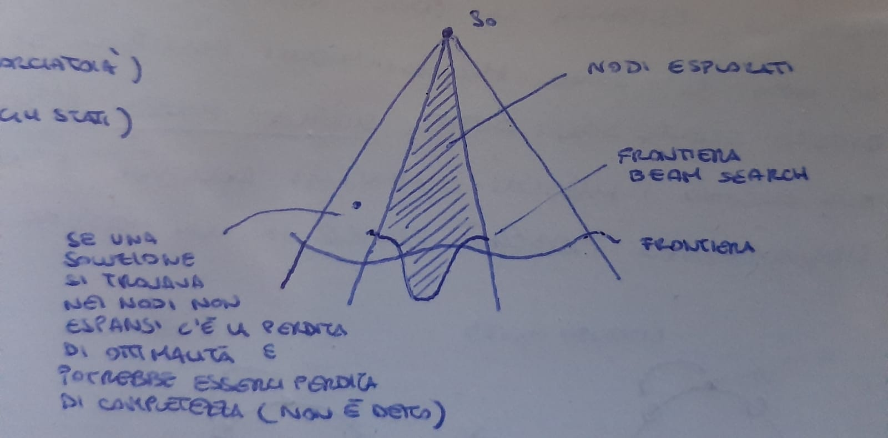

# Intelligenza Artificiale 

UNIVERSITA’ DEGLI STUDI DI FIRENZE \
Facolta di Ingegneria \
Corso di Laurea in Ingegneria Informatica \
[[B003725] Intelligenza Artificiale](https://ai.dinfo.unifi.it/teaching/ai_2023.html)
___

Professore : [Paolo Frasconi](paolo.frasconi@pm.me) \
Textbook : [Artificial Intelligence: A Modern Approach](<!-- #TODO -->) (4th Edition)
___

##### Indice: <!-- #TODO -->
- [Introduzione al corso](#introduzione-al-corso)
- [Rapporto intelligenza artificiale e intelligenza umana](#rapporto-intelligenza-artificiale-e-intelligenza-umana)
- [Agente e Ambiente](#agente-e-ambiente)
- [Problemi di Ricerca](#problemi-di-ricerca)
- [Algoritmi di Ricerca](#algoritmi-di-ricerca)
- [Algoritmi di Ricerca Non Informata](#algoritmi-di-ricerca-non-informata)
- [Algoritmi di Ricerca Informata](#algoritmi-di-ricerca-informata)
- [Problemi di Ottimizzazione](#problemi-di-ottimizzazione)
- [Problemi di Soddisfacimento di Vincoli](#problemi-di-soddisfacimento-di-vincoli)
___

#### Introduzione al corso

Il corso corrente si concentra un alcune delle tecniche più importanti dell'Intelligenza Artificiale, con particolare attenzione alle __G.O.F.A.I.__ (Good Old Fashioned Artificial Intelligence) e alle tecniche di Machine Learning. In particolare vedremo alcune tecniche simboliche, problemi di ricerca (eg. pathfinding), problemi di soddisfacimento di vincoli, problemi di rappresentazione della conoscienza e ragionamento, ecc. Inoltre vedremo alcune tecniche di Machine Learning, come le reti neurali, le reti bayesiane, il reinforcement learning, ecc.  

Nel passato, in qualità di umani ci siamo sempre interrogati su come il nostro cervello funziona, come percepisce il mondo circostante e la natura della nostra coscienza. Con la nascita di questa nuova disciplina/campo di studio, l'intelligenza artificiale, siamo passati a porci nuovi obbiettivi, ovvero ricreare, simulare, quello che accade biologicamente nei nostri cervelli.

Il campo dell'ai è in un periodo di massimo sviluppo, investendo il mercato e le società di ricerca e sviluppo che ci investono i bilioni e dei nuovi orizzonti sono stati posti alla conoscienza umana. Mentre per i campi come la fisica o la matematica, le grandi '_scoperte_'  sono state già fatte, l'intelligenza artificiale è una disciplina ancora estremamente giovane e proliferante di innovazioni.

I campi di applicazioni sono infiniti: dalla medicina alla fisica e matematica stessa (riconoscere malattie e provare teoremi ecc.).

Cosa si intende per intelligenza? non è facile da definire, molti filosofi, ingegnieri ecc ci hanno provato dando delle definzioni diverse molti hanno definito intelligente ciò chè è razionale (vale a dire in certi termini, ciò che fa la cosa giusta). Questa definizione crea, però delle dicotomie fra ciò che è '_human-like_' e che quindi in qualche modo ammette errore e '_rational_' e che quindi è matematicamente, statisticamente corretto, fra ciò che è pensiero e ragionamento. Nelle varie branche dell' a.i. si studiano metodi, algoritmi, modelli specifici per emulare, ricreare questi aspetti dell'intelligenza. 

Ormai superato ma ancora utile a delineare alcuni aspetti delle moderne a.i. è il test proposto da Turing per rispondere alla domanda: "può un computer pensare?". Quello che realmente si salva di quel test sono le macrobranche di ricerca in campo a.i. 
Per passare il test di fatto la macchina dovrebbe passare 6 tipi di test: _natural language processing_, _knowledge rappresentation_, _automated reasoning_, _machine learning_ (nel senso di estrapolazione di pattern), _computer vision_ e _robotics_.

<!-- #TODO --> complete summary cap. 1
___

#### Rapporto intelligenza artificiale e intelligenza umana

Abbiamo brevemente introdotto il concetto di agente razionale e di razionalità, ci concentreremo ora nel definirlo meglio e vedere come questo concetto viene applicato in diversi ambiti con pochi cambiamenti.

|                    | Think | Act |
| ------------------ | ----- | --- |
|   __like Humans__  |   no  |  no |
|__with Rationality__|   no  | yes |

__Razionalità__: in termini semplici "fare la cosa giusta", vale a dire massimizzare il risultato _atteso_ ( il risultato reale può essere diverso da quello atteso, ma la scelta è stata fatta sulla base di quello che si pensava fosse il risultato migliore, ambiente potrebbe essere non deterministico o non osservabile). Il risultato atteso dipende dalla conoscenza dell'agente, dalle azioni che può eseguire e dal modo in cui le azioni influenzano lo stato del mondo, e dall'obiettivo che gli viene posto (quest ultimo in particolare non facile da modellare).

Questo modello, paradigma di razionalità, è così ampiamente accettato che viene spesso chiamato _"the standard model"_. Uno dei problemi di questo modello è che non è sempre possibile o facile allineare l'obiettivo dell'agente con quello dell'umano, questo problema è detto _"value alignment problem"_. Ad esempio se si vuole costruire un agente che deve guidare una macchina, l'obiettivo dell'agente è quello di portare il passeggero a destinazione, ma se per fare ciò deve superare un semaforo rosso, l'obiettivo dell'agente non è allineato con quello dell'umano, che è quello di non superare il semaforo rosso. Questo problema è particolarmente importante ed è causa principale dello scetticismo verso l'Intelligenza Artificiale[^1]. 

[^1]: Vedi intervista a [Geoffrey Hinton](https://youtu.be/qpoRO378qRY?si=UE93Z4cKHS5RbcRc). 

Un concetto ulteriore che non indagheremo in profondità è quello di _razionalità limitata_ che dipende quindi da tempo o risorse limitate. 
___

#### Agente e Ambiente
Definito cosa intediamo per razionalità vediamo in cosa consiste nel contesto del modello agente-ambiente. E' facile concepire che ci siano agenti che in un determinato ambiente si comportino meglio di altri, vogliamo dunque l'agente che si comporti al meglio possibile. 
Quanto effettivamente poi questo agente si comporti bene dipenderà dall'ambiente e dalle difficoltà che questi pone.

<!-- #TODO --> add image
 \
La rappresentazione non è di tipo insiemistico ma relazionale, l'agente e l'ambiente vanno sempre intesi come due entità distinte. E' tuttavia possibile che in un ambiente multiagente, un agente dipenda dagli altri e quindi li percepisca e agisca su di loro come parte dell'ambiente. 

__Agente__: qualcosa che percepisce l'ambiente tramite sensori e agisce su di esso tramite attuatori. \
__Percezione__: ciò che viene percepito dall'agente tramite sensori. \
__Sequenza di Percezioni__: la storia completa di ciò che l'agente ha percepito fino ad un certo momento \
__Funzione agente__: mappa da sequenze di percezioni a azioni (in alcuni casi anche da sequenze di percezioni a sequenze di azioni). La funzione agente è un oggetto matematico di cardinalità infinita e pertanto non implementabile fisicamente (in generale). La funzione agente determina il passaggio di stato quindi questo dipende esclusivamente dalla sequenza di percezioni e la base di conoscienze (caratteristica dei sistemi causali)e in certi casi in forma ancora più restrittiva, vale la legge di Markov, quindi il passaggio di stato dipende esclusivamente dallo stato precedente. \
__Programma agente__: implementazione fisica della funzione agente (non per mezzo di una mappa, ma tramite un algoritmo). La differenza fondamentale dalla funzione agente è che è fisico non un astrazione matematica.

Abbiamo definito lascamente che un agente razionale è l'agente che fa la cosa giusta (tralasciando il fatto che non sepre è possibile fare la cosa giusta/ non sempre si hanno le informazioni per fare la cosa giusta), proviamo ora a dare una definizione più formale.

__Misura di prestazione__: criterio che determina il successo dell'agente data una sequenza di stati dell'ambiente (quindi la desiderabilità di una certo stato dell'ambiente data una sequenza di azioni). Come introdotto precedentemente la misura di prestazione non è necessariamente ottima, ma è quella che l'agente ritiene ottima sulla base della sua conoscenza e obiettivo. Definire questa funzione obbiettivo è come stato detto in precedenza molto complesso perchè può portare l'agente a prendere decisioni inaspettate che nel peggiore dei casi potrebbero essere dannose. Di solito una buona regola per definire una misura di prestazione è definirla in accordo a ciò che si vuole ottenere piuttosto a come crediamo che l'agente dovrebbe comportarsi. \
__Agente Razionale__: agente che sceglie l'azione che massimizza la misura di prestazione, data la sequenza di percezioni fino a quel momento e la base di conoscienze. 

Bisogna distingure fra razionalità e omniscienza. Un agente omniscente conosce il reale risvolto di ogni sua azione ma spesso questo è impossibile da ottenere. Razionalità $\neq$ Perfezione. Detto ciò bisogna assicurarci di aver fatto il possibile per prendere la decisione migliore, preso azioni per modificare le pecezioni future (__Information Gathering__). Eg. prima di attraversare la strada guardare a destra e sinistra ci permette di massimizzare l'azione futura da prendere (decide se attraversare la strada o aspettare il passaggio delle macchine). Non solo l'agente deve ottenere nuove informazioni ma imparare da esse, modificando o ampliando la propria conoscenza di base. Un agente che dipende dalla propria conoscenza a priori si dice manchi di __autonomia__.

> __Domanda__: il concetto di autonomia è relativo alla conoscenza di base e ai bias che il programmatore dell'a.i. ha inserito all'interno. Lo stesso concetto puo essere applicato anche alla misura di prestazione? in altre parole può anch'essa essere soggeta a bias? e dunque c'è un modo/ esistono ai indipendenti da essa che imparano la propria misura di prestazione?

__Ambiente__: ciò che circonda l'agente, ha diverse caratteristiche che possono variare molto da problema a problema (la definizione varia quindi molto e quella che segue è informale, più simile ad una lista di caratteristiche):

<div style="position: absolute; border-left: 1px solid #000; height: 7vh; margin: 0 0;"> </div>

- __Completamente osservabile__ : l'agente può vedere lo stato dell'ambiente in ogni momento.
- __Parzialmente osservabile__ : l'agente può vedere solo una parte dello stato dell'ambiente in ogni momento.

<div style="position: absolute; border-left: 1px solid #000; height: 7vh; margin: 0 0;"> </div>

- __Agente singolo__ : un solo agente opera nell'ambiente.
- __Multiagente__ : più agenti operano nell'ambiente (in questo caso il problema può essere cooperativo o competitivo).

<div style="position: absolute; border-left: 1px solid #000; height: 7vh; margin: 0 0;"> </div>

- __Deterministico__ : l'effetto delle azioni è determinato dallo stato attuale dell'ambiente.
- __Non deterministico__ : l'effetto delle azioni è non determinato dallo stato attuale dell'ambiente.

<div style="position: absolute; border-left: 1px solid #000; height: 7vh; margin: 0 0;"> </div>

- __Episodico__ : le azioni dell'agente non dipendono dalle azioni precedenti.
- __Sequenziale__ : le azioni dell'agente dipendono dalle azioni precedenti.

<div style="position: absolute; border-left: 1px solid #000; height: 7vh; margin: 0 0;"> </div>

- __Statico__ : l'ambiente non cambia mentre l'agente sta pensando.
- __Dinamico__ : l'ambiente cambia mentre l'agente sta pensando.

<div style="position: absolute; border-left: 1px solid #000; height: 7vh; margin: 0 0;"> </div>

- __Discreto__ : l'ambiente ha un numero di stati assumibili discreto (la nozione di discreto può essere applicata anche al numero di azioni e percezioni).
- __Continuo__ : l'ambiente ha un numero di stati assumibili continuo.

<div style="position: absolute; border-left: 1px solid #000; height: 7vh; margin: 0 0;"> </div>

- __Conosciuto__ : l'agente conosce le regole dell'ambiente.
- __Sconosciuto__ : l'agente non conosce le regole dell'ambiente.
___

#### Problemi di Ricerca

Come è pressapocamente detto a volte è necessario all'agente per prendere decisioni razioniali, pianificare in anticipo le proprie azioni. Un agente di questo tipo è detto '_problem-solving agent_' (nel caso la rappresentazione dello stato dell'ambiente sia atomica, indivisbile) o '_planning agent_' (nel caso abbia sovrastrutture interne, rappresentazioni dello stato dell'ambiente) e la ricerca attuata dallo stesso è appunto detta '_search_'. Analizzeremo solo ambienti semplici: episodici, agente singolo, completamente osservabili, deterministici, statici, discreti e conosciuti. 

Una prima distinzione da fare è fra algoritmi di ricerca informati e non informati:
- __Informati__ : l'agente può stimare quanto è distante dall'obbiettivo
- __Non informati__ : altrimenti.

Le fasi di risoluzione del problema sono fondamentalmente 4:
- formulazione del goal
- formulazione del problema (ricrea un modello dell'ambiente in cui possa simulare le azioni da intraprendere)
- ricerca, appunto simula le varie azioni fino al raggiungimento dell'obbiettivo. Tale sequenza di azioni è _una_ soluzione.
- esecuzione

__Formalizzazione__:

Chiamiamo $P$ il __problema di ricerca__. \
Chiamiamo $P.S$ l'insieme degli __stati__ in cui l'ambiente può trovarsi. \
Chiamiamo $P.$ __$s_0$__ $\in P.S$ lo __stato iniziale__ da cui l'agente parte. \
Chiamiamo $P.G$ l'insieme (che ha spesso cardinalità 1) degli stati obbiettivo, dei __goals__. E' utile definire una funzione, matematicamente una mappa, booleana $P$.__IS_GOAL__(s) che dato uno stato verifica che questi appartenga a $P.G$. \
Chiamiamo $P.A$ l'insieme di tutte le possibili azioni intraprendibili dato un qualsiasi stato. \
Definiamo una funzione $P$.__ACTIONS__(s) che dato uno stato resituisce l'insieme delle possibili azioni che possono essere eseguite in __s__. \
Definiamo la funzione $P$.__RESULT__($s_i$, a), detta __funzione di transizione__, la funzione che dato lo stato __$s_i$__ $\in P.S$ e l'azione __a__ $\in P.A$ restituisce lo stato __$s_f$__ $\in P.S$ ottenuto applicando l'azione __a__ allo stato __$s_i$__. \
Definiamo una funzione $P$.__ACTION_COST__(s, a, s$' = P$.__RESULT__(s, a)) che restituisce un valore numerico indicativo del costo di esecuzione dell'azione __a__ dato lo stato __s__. 

> __Osservazione__: s$' = P$.__RESULT__(s, a) è completamente omissibile

Chiamiamo __percorso__ una sequenza di azioni, e __soluzione__ un percorso da __$s_0$__ a __g__ $\in P.G$. Diciamo che una soluzione è __ottima__ se la somma dei costi dato un percorso è minima ( la minore fra i costi di tutti i percorsi possibili ).

Lo __spazio delgi stati__ viene usato intercambiabilmente per indicare $P.S$ e il grafo con nodi $P.S$ e archi $P$.__ACTIONS__.
___

#### Algoritmi di Ricerca

Chiamiamo __algoritmo di ricerca__ un algoritmo che dato un problema di ricerca restituisce una soluzione o uno stato di _failure_. Ci sono diversi approcci per trovare una soluzione, in questo caso analizzeremo algoritmi che imporranno un __albero di ricerca__ nel grafo dello spazio degli stati che ha radice in __$s_0$__. Rispetto allo spazio delgi stati che da premessa era discreto, l'albero di ricerca può essere potenzialmente infinito anche con uno spazio finito poichè uno stesso stato potrebbe avere percorsi diversi indietro fino allo stato iniziale. L'albero di ricerca è un grafo acicilico (per definizione) ma i percorsi che definisce possono essere ciclici (_loopy paths_). Un ciclo è un caso speciale di percorso ridondante (_redundant path_). Ci sono tre approcci per affrontare questo problema: memorizzare i nodi già visitati ed evitare di riespanderli, ignorare il problema con le dovute analisi (in molti problemi il caso di ripetere un certo percorso è molto improbabile), controllare per i cicli ma non per percorsi ridondanti. <!-- #TODO --> clarify 
Chiamiamo un algoritmo ___graph search___ se evita di riespandere i nodi già visitati. \
Chiamiamo un algoritmo ___tree-like search___ se non evita di riespandere i nodi già visitati.

<figure style = "display: block; margin-left: auto; margin-right: auto; width: 50%;" >
    
    <figcaption>Se nello stato del problema non fosse rappresentato un counter per il controllo della <i>threefold repetition rule</i> l'albero di ricerca potrebbe diramarsi ripetendo all'inifinito oscillando tra due stati (se le mosse sono reversibili)</figcaption>
</figure>

Da qui in avanti se non specificato ci riferiremo a _nodi_ per intendere i _nodi_ dell'albero di ricerca.
L'insieme di nodi ottenuti dal risultato di $P$.__RESULT__($s_i$, a), $\forall$ __a__ $\in P$.__ACTIONS__($s_i$) sono detti nodi __figli__ (risultato diretto) o __successori__ (esecuzione ripetuta della funzione) di __$s_i$__, mentre __$s_i$__ è il nodo __genitore__.
Dopo l'esecuzione di _result_ __$s_i$__ si dice __espanso__.

Un nodo ottenuto dall'esecuzione di _result_ o la radice dell'albero si dice __raggiunto__.\
L'insieme di nodi non ancora espansi si dicono __frontiera__ o ___open list___ (la frontiera separa nello spazio degli stati i nodi espansi da quelli non ancora raggiunti).

L'algoritmo di ricerca più generale è la ___Best-first search___ : algoritmo di ricerca che espande il nodo che sembra più vicino al goal data una ___evaluation function___ $f$($n$). La frontiera in questo caso è implementata con una ___Priority Queue___. Questo algoritmo è un algoritmo di ricerca informata, in quanto usa una funzione di valutazione che stima la distanza dal goal. Esistono anche algoritmi di ricerca non informata, che non usano una funzione di valutazione ma che espandono i nodi in ordine di profondità o di costo.

Per misurare le performance di un algoritmo di ricerca si usano quattro parametri:
- __Completezza__ : l'algoritmo trova sempre una soluzione se esiste.
- __Ottimalità__ : l'algoritmo trova sempre la soluzione ottima se esiste.
- __Complessità spaziale__ : quanti nodi vengono memorizzati in memoria.
- __Complessità temporale__ : quanti nodi vengono generati e espansi.

Complessità spaziale e temporale sono misurate in termini di __b__ (fattore di branching, numero massimo di nodi figli di un nodo), __d__ (profondità massima dell'albero per la soluzione ottima) e __m__ (il massimo numero di azioni per un qualsiasi percorso), $||P.S||$ e $||(P.S \times P.A)||$ . 
___

#### Algoritmi di Ricerca Non Informata

<div style="float:right;margin:0 40px 60px 0" markdown="1">

</div>

- ___Breadth-first search___ : algoritmo di ricerca che espande tutti i nodi della frontiera, in ordine di profondità. La frontiera in questo caso è implementata con una ___FIFO Queue___. Analogo ad una best-first search con $f$ che restituisce la profondità del nodo. Se i costi sono uniformi la breadth-first search può fare un _early goal test_ per la proprietà di aver eplorato all'iterazione precedente di __d__ tutti i nodi a profondità __d - 1__.\
- ___Depth-first search___ : algoritmo di ricerca che espande il nodo più profondo della frontiera. La frontiera in questo caso è implementata con una ___LIFO Queue___. Analogo ad una best-first search con $f$ che restituisce la profondità del nodo con segno negativo. Solitamente implementato non come una _graph search_ ma come una _tree-like search_. Un implementazione ancora più avanzata vedremo più avanti si chiama ___backtracking search___. 
- ___Iterative deepening search___ : algoritmo di ricerca che esegue una depth-first search con limite di profondità __l__ e incrementa __l__ fino a trovare una soluzione. Completo e ottimo, ma non particolarmente efficiente. 
- ___Bidirectional search___ : algoritmo di ricerca che esegue una breadth-first search da __$s_0$__ e una da __g__ e si ferma quando le due frontiere si incontrano. Necessita di conoscere il goal ottimale e la funzione inversa di transizione. 

<details>
    <summary><b>Code</b>: Tree search</summary>

```python

    def tree_search(problem, frontier, depth = -1):
    frontier.append(node(problem.s_0))
    while frontier:
        node = frontier.pop()
        if problem.is_goal(node.s):
            return node
        if depth != -1 and node.g < depth:
            for action in problem.actions(node.s):
                # we are considering the path cost to be 1 for all actions -> child.g = parent.g + 1
                child = node(problem.result(node.s, action), node, action, node.g + 1) 
                frontier.append(child)
    return None
```

[See full python implementations for search problems](./algorithms/search_problems.py)
</details> 

<br>

||__Breadth-first__|__Uniform cost__$^3$|__Depth-first__|__Depth-limited__|__Iterative deepening__|__Bidirectional__$^4$|
|---|---|---|---|---|---|---|
|__Completezza__|✓$^1$|✓$^{1,2}$|✗|✗|✓$^1$|✓$^1$|
|__Ottimalità__|✓$^3$|✓|✗|✗|✓$^3$|✓$^{3,4}$|
|__Tempo__|$O(b^d)$|$O(b^{1 + \lfloor C^*/\epsilon \rfloor})$|$O(b^m)$|$O(b^l)$|$O(b^d)$|$O(b^{d/2})$|
|__Spazio__|$O(b^d)$|$O(b^{1 + \lfloor C^*/\epsilon \rfloor})$|$O(bm)$|$O(bl)$|$O(bd)$|$O(b^{d/2})$|

1. Se b è finito e se lo spazio degli stati ha soluzione o è finito.
2. Se tutti i costi sono maggiori di un certo valore $\epsilon > 0$.
3. Se tutti i costi sono uguali.
4. Se si conosce il goal ottimale e si conosce la funzione inversa di transizione.
____

#### Algoritmi di Ricerca Informata

Abbiamo già introdotto il concetto di algoritmo di ricerca informata, ovvero un algoritmo che usa una funzione di valutazione che stima la distanza dal goal. Questa funzione è detta ___heuristic function___ e viene indicata con $h$($n$). Una funzione euristica è una funzione che stima il costo minimo del percorso dal nodo $n$ al goal.

Eg.
- ___Greedy best-first search___ : algoritmo di ricerca che espande il nodo che sembra più vicino al goal data una ___evaluation function___ $f$($n$) = $h$($n$). E' completo per spazi di ricerca finiti, ma non per spazi infiniti. 
- ___A* search___ : algoritmo di ricerca che espande il nodo data una ___evaluation function___ $f$($n$) = $g$($n$) + $h$($n$) dove $g$($n$) è il costo del percorso dal nodo iniziale al nodo $n$ mentre $h$($n$) è la funzione euristica precedentemente descritta. Quindi $f$($n$) è una stima del costo del percorso dal nodo iniziale al goal passando per $n$. E' completo e ottimo se $h$($n$) è ammissibile.

___admissible heuristic___ : una funzione euristica $h$($n$) è ammissibile se $h$($n$) non sovrastima mai il costo del percorso dal nodo $n$ al goal. Ovvero se $h$($n$) $\leq$ $h^*$($n$) dove $h^*$($n$) è il costo del percorso minimo dal nodo $n$ al goal.

<details>
    <summary><b>Theorem</b>: A<sup>*</sup> è ottimo se h(n) è ammissibile </summary> 

> __Proof__: Supponiamo per assurdo che se $C^*$ il costo del percorso ottimo dal nodo $s_0$ al goal ottimale, e $f(n)$ il costo del percorso stimato dalla funzione euristica $h$($n$). Allora $f(n) > C^*$. Allora  ci deve essere un nodo che è nel percorso ottimale e non è stato espanso. Chiamiamo quindi $g^*$($n$) il costo del percorso ottimo dal nodo $s_0$ a $n$ e $h^*$($n$) il costo del percorso ottimo da $n$ al goal ottimale. Allora noi abbiamo affermato che $f(n) > C^*$
> $f(n) = g(n) + h(n) = g^*(n) + h(n)$ perchè n si trova sul percorso ottimo
> $f(n) \leq g^*(n) + h^*(n)$ per la definizione di funzione euristica ammissibile
> $\implies f(n) \leq C^*$ che contradice l'ipotesi iniziale. Quindi $f(n) \leq C^*$ e quindi A* è ottimo.

</details>

<br>

___consistent heutistic___ : una funzione euristica $h$($n$) è consistente se $h$($n$) $\leq$ $P$.__ACTION_COST__($n$, $a$) + $h$($n'$) dove $n'$ = $P$.__RESULT__($n$, $a$) $\forall n, n' \in P.S$.

Tutte le funzioni euristiche consistenti sono ammissibili. Una funzione euristica ammissibile non è necessariamente consistente. Una funzione euristica consistente è detta anche ___monotonic___ (poichè monotona crescente).
$f(n') = g(n') + h(n') = g(n) + P$.__ACTION_COST__($n$, $a$) + $h(n') \geq g(n) + P$.__ACTION_COST__($n$, $a$) + $h(n) = f(n)$


Un modo per caratterizzare la qualità di una funzione euristica è l'___effective branching factor___ $b^*$. Se il numero totale di nodi generati è $N$ e la profondità della soluzione ottima è $d$ allora $b^*$ è il fattore di branching che avrebbe un albero di ricerca completo con $N$ nodi e profondità $d$ per contenere $N+1$ nodi. $N+1 = 1 + b^* + (b^*)^2 + ... + (b^*)^d = \frac{(b^*)^{d+1} - 1}{b^* - 1}$. 
Chiamiamo ___prenetance___ $p = \frac{d}{N}$ il grado di prenetazione nell'albero. La prenetance assume valori compresi fra 0 e 1, maggiore è $p$ più è 'efficiente' $h$. 
Se un euristica $h_1$ è migliore ($\geq$) di un euristica $h_2 \forall n \in P.S$ allora diciamo che $h_1$ __domina__ $h_2$. Un modo di costruire una funzione euristica è di rilassare il problema creando un supergrafo di $P.S$ e definendo una funzione euristica su questo supergrafo.
Date due euristiche possiamo sempre costruirne una migliore prendendo il massimo dei due valori $h(n) = $ max{$h_1(n), h_2(n), \dots, h_k(n)$}. 
Un euristica più informata esplora un sottoinsieme dei nodi esplorati da un euristica meno informata.

<details>
    <summary> <b>Example</b>: Euristica per un percoso di un cavallo </summary>

> __Problema__: data una scacchiera di dimensione $n \times m$ (non necessariamente finita) trovare un percorso per un cavallo che da $s_0$ arrivi a $g$. 

<div style="float:left;margin:0 20px 0 0" markdown="1">

</div>

__Euristiche ammissibili__:
- $h_1(n) = h_{\text{Manhattab Dist.}}(n) / 3$ 
    Il cavallo si muove di 3 caselle alla volta, quindi il numero di mosse necessarie per arrivare al goal è almeno la distanza di Manhattan diviso 3.
- $h_2(n) = \begin{cases} \lceil h_1(n) \rceil \text{ se } \lfloor h_1(n) \rfloor \text{mod } 2 = 1 \\ \lfloor h_1(n) \rfloor \text{ se } \text{ se } \lfloor h_1(n) \rfloor \text{mod } 2 = 0 \end{cases}$
    Possiamo dire che $h_2 = h_1$ arrotondato con parità 'corretta', in questo caso teniamo conto che il cavallo si muove in modo alternato su caselle bianche e nere. 
- $h_3(n) = \text{max (} \frac{\lceil g_x - s_{0x} \rceil}{2}, \frac{\lceil g_y - s_{0y} \rceil}{2}$)
    Il cavallo si muove di 2 caselle in una direzione e 1 in un'altra, quindi il numero di mosse necessarie per arrivare al goal è almeno la distanza di Manhattan diviso 2.
</details>

<br>

Un idea molto simile a quella appena analizzata l'abbiamo vista nel corso di Algoritmi e Strutture dati, ovvero il concetto di ___dynamic programming___, quello che possiamo fare infatti anche con le euristiche, è di definire una funzione euristica $h$($n$) come la soluzione ottima di un sottoproblema di $P$ che ha come stato iniziale $n$. Questo è possibile se il problema $P$ ha la proprietà di ___optimal substructure___, ovvero se la soluzione ottima di un problema è composta dalle soluzioni ottime dei suoi sottoproblemi. Nell'ambito dell'ai è detto ___pattern database___. 

<!-- #TODO --> add landmark heuristic

<div style="float:left;margin:0 20px 0 0" markdown="1">

</div>

<!-- #TODO --> fix image

Un idea per limitare lo spazio di memorida occupata da un algoritmo di ricerca è mettere un limite alla dimensione massima alla coda con priorità (la frontiera). Un nuovo nodo viene inserito nella coda solo se il suo valore di priorità è maggiore del valore di priorità del nodo con valore minore. Questo algoritmo è detto ___Beam search___.
- Perde l'ottimalità (perchè potrebbe aver 'scartato' una 'scorciatoia')
- Perde la completezza (perchè potrebbe non trovare una soluzione anche se esiste, non esplorando tutti gli stati)
___

#### Problemi di Ottimizzazione

Rispetto alla classe di problemi di ricerca in cui eravamo interessati al percorso per arrivare al goal, in questo caso siamo interessati al trovare il goal ottimale. Questo tipo di problemi sono detti ___problemi di ottimizzazione___.

<details>
    <summary> <b>Example</b>: Problema delle n-regine (solitamente n = 8) </summary>

> __Problema__: dato un scacchiera di dimensione $n \times m$ trovare una disposizione delle min($n$,$m$) regine dello stesso colore tale che nessuna regina possa mangiare (stia minacciando) un'altra regina (solitamente n = m, useremo questa condizione nelle considerazioni successive). Il problema ammette soluzione solo per $n \geq 4$ o $n = 1$ (anche $n = 0$ in teoria potrebbe essere considerato con soluzione).


In questo caso utilizzare un algoritmo di ricerca non è efficiente (ragioni matematiche motivate successivamente). Il motivo intuitivo però è come detto precedentemente che non ci interessa il percorso per arrivare al goal ma il goal stesso (ovvero la configurazione delle regine). Ciascuna permutazione di mosse (piazzare una regina) per arrivare a tale configurazione è una soluzione valida e quindi le diramazioni sono molte e non ci interessa esplorarle tutte. E' evidente che non è possibile usare la ricerca bidirezionale in questo caso, perchè non si conosce il goal ottimale.

La risoluzione di questo problema può essere affrontata usando diversi tipi di algoritmi, quelli che non tengono conto del percorso ma solo dei nodi adiacenti sono detti ___local searches___ mentre il problema è detto ___optimization problem___.
Le local searches hanno il vantaggio notevole di non richiedere molto spazio di memoria ($O(1)$, poichè la frontiera è costante).

</details>

<br>

La funzione che vogliamo ottimizzare è detta ___objective function___ e viene indicata con $f$($n$). Vogliamo quindi trovare il massimo globale di $f$($n$) per $n \in P.S$. Chiamiamo questo processo ___hill climbing___. Se la funzione obiettivo è una funzione di costo vogliamo trovare invece il minimo globale. Chiamiamo questo processo ___gradient descent___.

__Hill Climbing__ : 


Facendo riferimento al problema d'esempio possiamo porre come funzione obiettivo come l'opposto del numero di regine che minacciano un'altra regina. Per muoverci da uno stato all'altro seguiamo lo stato che migliora maggiormente la funzione obiettivo. Quando non ci sono più stati che migliorano la funzione obiettivo siamo arrivati ad un massimo locale è un probabile goal, per questo motivo non è completo, trovato un massimo locale si ferma senza cercare l'effettiva soluzione ottima. Questo algoritmo è a volte detto ___greedy local search___. Altre ragioni che potrebbero portare ad un massimo locale sono la presenza di un ___plateau___ (ovvero un insieme di stati adiacenti che hanno tutti la stessa funzione obiettivo) o un ___ridge___ (ovvero un insieme di stati relativamente vicini, tutti massimi locali).

<details>
    <summary><b>Code</b>: Hill Climbing</summary>

```python

    def hill_climbing(problem, f):
        current = node(problem.s_0)
        while True:
            neighbors = [node(problem.result(current.s, action)) for action in problem.actions(current.s)]
            if not neighbors:
                return current
            neighbor = max(neighbors, key = lambda n: f(n))
            if f(neighbor) <= f(current):
                return current
            current = neighbor

```

<!-- #TODO --> add actual code link (implementation)
</details> 

<br>

Se $P.S$ è finito l'algoritmo può essere reso completo con imponendo dei _random restartes_ (ovvero ripartire da un nodo casuale) o _random walk_ (ovvero scegliere un nodo casuale ad ogni iterazione). Questi algoritmi sono detti ___stochastic hill climbing___.

__Local Beam Search__ :

Nonostante il nome non è in relazione con la beam search, ma è un algoritmo di ricerca locale che mantiene $k$ stati in memoria (rispetto al singolo stato dell' hill climbing search). L'algoritmo inizia con $k$ stati casuali (in questo fondamentalmente analogo alla random restartes search) con la proprietà che questi $k$ stati possono 'comunicare' fra loro (diverso da random restartes searches, simile ad alcuni algoritmi di ricerca genetica). Ad ogni iterazione l'algoritmo seleziona i $k$ successori migliori fra i $k$ stati attuali. Se uno di questi stati è il goal allora l'algoritmo termina, altrimenti si ripete il processo. Se non ci sono stati migliori se ne prende uno a caso come per lo stochastic hill climbing. Queste scelte sono dette ___side ways moves___ e hanno l'obbiettivo di ovviare al problema dei plateau. Non risolvono il problema dei massimi locali/relativi perchè all'iterazione successiva si ritorna allo stato di massimo locale. Per questo motivo è necessario limiare il numero massimo di side ways moves, perchè finire in un massimo locale causa un loop infinito.

Data la natura dell'algoritmo è facilmente implementabile in parallelo, velocizzando l'esecuzione. 

La local beam search può soffrire la mancanza di diversità fra i $k$ stati rendendo la ricerca una versione poco più lenta di una hillclimbind search $k$ volte più lenta.

__Simulated Annealing__ :

Il principio alla base di questo algoritmo è ispirato dalle tecniche di temperaggio usate in metallurgia. Si diminuisce 'l'entropia termica' passando da una scelta causale a una sempre più pesata verso la scelta migliore (almeno secondo la funzione obiettivo). 

> __Osservazione__: legge di Boltzmann $P(s) = \frac{1}{z}e^{-\frac{E(s)}{kT}}$ dove $P$ è la probabilità di un certo stato, $E$ è l'energia del sistema dato lo stato, $k$ è la costante di Boltzmann, $T$ è la temperatura, $z$ un termine normalizzatore.

<div style="float:right;margin:0 60px 0 20px" markdown="1">

</div>

$p(s) = e^{\frac{\Delta E}{T}}$
$\Delta E = f(s') - f(s)$
$T \rightarrow 0 \implies p(s) \rightarrow 0$ 
$T \rightarrow \infty \implies p(s) \rightarrow 1$

$T$ segue una fuzione definita dal programmatore che diminuisce nel tempo.

> __Theorem__: Dato un problema $P$ esiste sempre una funzione $T$ abbastanza lenta da fare convergere $s$ alla soluzione ottima del problema (massimo <u>globale</u>).

<details>
    <summary> <b>Code</b>: Simulated Annealing </summary>

```python

    def simulated_annealing(problem, schedule):
        current = node(problem.s_0)
        for t in range(sys.maxsize): # infinite loop
            T = schedule(t)
            if T == 0:
                return current
            neighbors = [node(problem.result(current.s, action)) for action in problem.actions(current.s)]
            if not neighbors:
                return current
            neighbor = random.choice(neighbors)
            delta_e = f(neighbor) - f(current)
            if delta_e > 0 or random.uniform(0, 1) < math.exp(delta_e / T):
                current = neighbor

```

[See full python implementations for local search problems](./algorithms/local_search_problems.py)

</details>

<br>

<!-- #TODO --> add genetic algorithms
___

#### Problemi di Soddisfacimento di Vincoli

Un approccio completamente diverso alla risoluzione dei problemi presentati, e molti altri come job scheduling, magic squares, ecc. è quello di usare un algoritmo di soddisfacimento di vincoli. Questo tipo di algoritmi sono detti ___constraint satisfaction problems___ (CSP) a volte indicati come ___constraint programming___.

Questo tipi di problemi viene risolto per inferenza, ovvero propagando i vincoli e le assegnazioni. La struttura di un CSP è ben diversa da quella di un problema di ricerca. 

I problemi di programmazione lineare sono un caso particolare di CSP (eg. problema del simplesso). I CSP sono NP-completi, quindi non esiste un algoritmo polinomiale per risolverli.

__Formalizzazione__:
Chiamiamo __$X$__ $ = \{ X_1, \dots, X_n \} $ l'insieme delle __variabili__ del problema. \
Chiamiamo __$D$__ $ = \{ D_1, \dots, D_n \} $ l'insieme dei __domini__ di ciascuna variabile. \
Chiamiamo __$C$__ l'insieme di vincoli. \
Ciascun vincolo $c_i$ è una coppia $<scope, rel>$ dove $scope$ è una tupla di variabili e $rel$ è una relazione che specifica i valori che le variabili possono assumere. \

Un __assegnamento__ è una funzione $A$ che associa ad ogni variabile un valore del suo dominio. \
Un assegnamento è __consistente__ se non viola nessun vincolo. \
Chiamiamo __assegnamento completo__ un assegnamento che associa un valore ad ogni variabile. \
Una __soluzione__ è un assegnamento completo e consistente.

<details>
    <summary> <b>Example</b>: Problema di soddisfacimento di vincoli </summary>

> __Problema__: criptoaritmetica, ovvero trovare un assegnamento di valori alle lettere che renda vera l'equazione.
> X = {S, E, N, D, M, O, R, Y}
> D = {0, 1, 2, 3, 4, 5, 6, 7, 8, 9} 
> C : __SEND__ + __MORE__ = __MONEY__ (andrebbe formalizzato meglio, un'altro vincolo è che le lettere non possono avere lo stesso valore)
> soluzione = {S:9, E:5, N:6, D:7, M:1, O:0, R:8, Y:2}

lo stesso problema può essere formalizzando prendendo altre variabili e vincoli
> X = {S, E, N, D, M, O, R, Y, C1, C2, C3, C4}
> D = {0, 1, 2, 3, 4, 5, 6, 7, 8, 9}
> C : S + M = C1 + 10 * C2, E + O + C1 = C2 + 10 * C3, N + R + C2 = C3 + 10 * C4, D + E = C4
ecc.

> __Problema__: colorazione di una mappa, ovvero trovare un assegnamento di colori ai territori in modo che territori adiacenti abbiano colori diversi.
> Mappa dell'australia X = {WA, NT, Q, NSW, V, SA, T}
> D = {red, green, blue}
> C : WA $\neq$ NT, WA $\neq$ SA, NT $\neq$ SA, NT $\neq$ Q, SA $\neq$ Q, SA $\neq$ NSW, SA $\neq$ V, Q $\neq$ NSW, NSW $\neq$ V (in realtà dovremmo scrivere $<(SA,WA), SA \neq WA> \in C \dots$)
> soluzione = {WA:red, NT:green, Q:red, NSW:green, V:red, SA:blue, T:red}


> __Problema__: sudoku, ovvero trovare un assegnamento di valori alle caselle che rispetti le regole del gioco.
> X = $\{X_{i,j} | i,j \in \{1, 2, 3, 4, 5, 6, 7, 8, 9\}\}$
> D = {1, 2, 3, 4, 5, 6, 7, 8, 9}
> C : $\forall i,j \in \{1, 2, \dots , 9\}, i \neq j \implies X_{i,j} \neq X_{i,j}$ (ovvero non ci possono essere due valori uguali nella stessa riga)
> $\forall i,j \in \{1, 2, \dots , 9\}, i \neq j \implies X_{i,j} \neq X_{i,j}$ (ovvero non ci possono essere due valori uguali nella stessa colonna)
> $\forall i,j \in \{1, 2, \dots , 9\}, i \neq j \implies X_{i,j} \neq X_{i,j}$ (ovvero non ci possono essere due valori uguali nella stessa regione)

</details>

<br>

<details>
    <summary> <b>Proof</b>: CSP (quando applicabile) più efficiente Searching algorithms </summary>

Riprendiamo il problema delle n-regine con $n = 8$. Abbiamo già visto come questo può essere formalizzato e risolto come problema di ricerca. Vediamo ora come può essere formalizzato come CSP.

> ||X|| = 64
> D = {0, 1} (0 = non presente, 1 = presente)
> C : $\forall i, j \in X, i \neq j \implies \neg$ (i e j sono sulla stessa riga o sulla stessa colonna o sulla stessa diagonale), $\sum_{i \in X} i = 8$ (ovvero ci sono 8 regine)

una formalizzazione più efficiente è quella di usare un dominio di 8 valori (le righe) e vincoli che impongono che non ci siano due regine sulla stessa colonna o sulla stessa diagonale. 

> ||X|| = 8
> D = {1, 2, 3, 4, 5, 6, 7, 8}
> C : $\forall i, j \in X, i \neq j \implies \neg$ (i e j sono sulla stessa colonna o sulla stessa diagonale)
> $\forall i,j \in \{1, 2, \dots , ||X||\}, i \neq j \implies X_i \neq X_j$
> $\forall i,j \in \{1, 2, \dots , ||X||\}, i \neq j \implies |X_i - X_j| \neq |i - j|$ 

<table style = "border: 0px solid #0000">
    <tr>
        <td>
            <table>
                <tr><td></td><td><b>a</b></td><td><b>b</b></td><td><b>c</b></td><td><b>d</b></td><td><b>e</b></td><td><b>f</b></td><td><b>g</b></td><td><b>h</b></td></tr>
                <tr><td><b>1</b></td><td>1</td><td>0</td><td>0</td><td>0</td><td>0</td><td>0</td><td>0</td><td>0</td></tr>
                <tr><td><b>2</b></td><td>0</td><td>0</td><td>0</td><td>0</td><td>0</td><td>0</td><td>1</td><td>0</td></tr>
                <tr><td><b>3</b></td><td>0</td><td>0</td><td>0</td><td>0</td><td>1</td><td>0</td><td>0</td><td>0</td></tr>
                <tr><td><b>4</b></td><td>0</td><td>0</td><td>0</td><td>0</td><td>0</td><td>0</td><td>0</td><td>1</td></tr>
                <tr><td><b>5</b></td><td>0</td><td>0</td><td>1</td><td>0</td><td>0</td><td>0</td><td>0</td><td>0</td></tr>
                <tr><td><b>6</b></td><td>0</td><td>0</td><td>0</td><td>0</td><td>0</td><td>1</td><td>0</td><td>0</td></tr>
                <tr><td><b>7</b></td><td>0</td><td>1</td><td>0</td><td>0</td><td>0</td><td>0</td><td>1</td><td>0</td></tr>
                <tr><td><b>8</b></td><td>0</td><td>0</td><td>0</td><td>1</td><td>0</td><td>0</td><td>0</td><td>0</td></tr>
            </table>
        </td>
        <td>
            
        </td>
    </tr>
</table>

| __$x_1$__ | __$x_2$__ | __$x_3$__ | __$x_4$__ | __$x_5$__ | __$x_6$__ | __$x_7$__ | __$x_8$__ |
|-------|-------|-------|-------|-------|-------|-------|-------|
| 1 (__a__) | 6 (__f__) | 8 (__h__) | 3 (__c__) | 7 (__g__) | 4 (__d__) | 2 (__b__) | 5 (__e__) |


Applicare un algoritmo di ricerca ad un problema formalizzato nel precedente modo comporta un 
__branching factor__ = $|D| \times |X|$ (ovvero per ogni variabile devo provare tutti i valori del dominio) \
__depth__ = $|X|$ (ovvero devo assegnare un valore ad ogni variabile) \
__number of leafs__ = $|X|! \times (|D|)^{|X|}$
__number of actual possible assignment__ = $|D|^{|X|}$

paghiamo $|X|!$ ovvero tutte le permutazioni fra le varie assegnazioni per ciascuna variabile, quando a noi non interessa la sequenza in cui queste vengono assegniate ma solo il valore finale. 

</details>

<br>

__Finite Domain Solver__ :
Itroduciamo dei concetti importanti.
___arc-consistent___ : $x_i$ si dice arc-consistent rispetto a $x_j$ se per ogni valore $x_i$ esiste un valore $x_j$ consistente con $x_i$ ovvero $\forall a \in D_i, \exists b \in D_j | (a,b) \text{ soddisfi i vincoli booleani di } (x_i, x_j)$. (tutti i CSP possono essere ridotti a SAT problem, ovvero con vincoli binari/booleani).

L'idea dell'algoritmo è di rendere arc-consistenti tutte le variabili, in questo modo siamo sicuri che esista una soluzione, riducendo i domini delle variabili.

> __Example__: Consideriamo un vincolo del tipo $Y = X^2$ con $D = \{1, 2, 3, 4, 5, 6, 7, 8, 9\}$ sia per X che per Y. Possiamo ridurre il dominio di Y a {1, 4, 9} poichè Y deve essere arc-consistent rispetto a X. Possiamo ridurre il dominio di X a {1, 2, 3} poichè X deve essere arc-consistent rispetto a Y.

Un algoritmo che rende arc-consistenti tutte le variabili è il ___AC-3___ (Arc Consistency 3) che è un algoritmo di ricerca locale. L'algoritmo è simile ad una BFS, ma invece di espandere i nodi espande gli archi. L'algoritmo è completo e termina in tempo polinomiale (?). <!-- #TODO --> check.

<details>
    <summary> <b>Code</b>: AC-3 </summary>
    
```python
    #O(|C| * |D|^3)

    def AC_3(csp): # csp with finite domains
        queue = [(X_i, X_j) for X_i in csp.X for X_j in csp.X if X_i != X_j] # all arcs
        while queue:
            (X_i, X_j) = queue.pop() # ha senso una funzione euristica per l'estrazione ?
            if revise(csp, X_i, X_j):
                if not csp.D[X_i]:
                    return False # no solution
                for X_k in csp.X: # propagate trough all neighbors of X_i
                    if X_k != X_i and X_k != X_j:
                        queue.append((X_k, X_i))
        return True

    def revise(csp, X_i, X_j):
        revised = False
        for x in csp.D[X_i]:
            if not any([csp.rel(X_i, x, X_j, y) for y in csp.D[X_j]]):
                csp.D[X_i].remove(x)
                revised = True
        return revised

    #by Macworth 1977
```

<!-- #TODO --> add actual code link (implementation)

</details>

<br>

Oltre l'AC-3 esistono altri algoritmi di ricerca locale che rendono arc-consistenti le variabili, come il ___AC-4___ ($O(|C| * |D|^2)$), ___AC-5___, ___AC-6___, ecc. che sono teoricamente più efficienti dell'AC-3, sfortunatamente l'AC-4 è anche $\Theta(|C| * |D|^2)$ e si verifica empiricamente che seppur l'AC-3 ha complessità peggiore peggiore, è mediamente migliore.