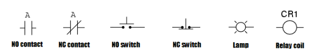

# Informatica industriale

UNIVERSITA’ DEGLI STUDI DI FIRENZE \
Facolta di Ingegneria \
Corso di Laurea in Ingegneria Informatica \
[[B003725] Informatica industriale](https://e-l.unifi.it/course/view.php?id=40941)
___

Professore : [Alessandro Fantechi]() \
Textbooks : [Informatica industriale](https://www.amazon.it/Informatica-industriale-Alessandro-Fantechi/dp/882517344X)
___

## Indice: 
- [Introduzione](#introduzione)
- [Sistemi real-time](#sistemi-real-time)
    - [Task](#task)
    - [Scheduling](#scheduling)
    - [Risorse condivise](#risorse-condivise)
    - [Sistemi operativi real-time](#sistemi-operativi-real-time)
- [Processori industriali](#processori-industriali)
    - [MCU](#mcu)
    - [DSP](#dsp)
    - [PLC](#plc)
    - [PC industriali](#pc-industriali)
    - [Smartcard](#smartcard)
___

## Introduzione

L'obbiettivo del corso è fornire gli strumenti per sviluppare sistemi _embedded_ e _real-time_. I sistemi __embedded__ sono sistemi informatici che sono integrati in altri dispositivi elettronici, come ad esempio i sistemi di controllo di un'automobile, o un forno a microonde, il computer controlla direttamente apparecchiature, impianti ecc; quindi sistemi generalmente costituiti da più processori. I sistemi __real-time__ sono sistemi informatici che devono rispondere a delle richieste in un tempo prefissato, come ad esempio i sistemi di controllo di un aereo, o di un impianto industriale. Devono essere garantite affidabilità, disponibilità e sicurezza funzionale. 

I __sistemi embedded__ sono sistemi composti da uno o più processori che fanno fisicamente parte di un sistema elettronico o meccanico che ne controllano il funzionamento. L'utente non percepisce la presenza di questi processori con funzionalità specifiche. Il processore fra le varie funzionalità ha quella di monitorare (attraverso __sensori__) determinate grandezze fisiche e di controllare (attraverso __attuatori__) le stesse. 

L'algoritmo che sovraintende a queste operazioni è detto __algoritmo di controllo__. Questi sono classificati in vario modo, in generale si distingue fra algoritmi di controllo __a tempo continuo__ e __a tempo discreto__. \
Per gli algoritmi di controllo a tempo continuo le grandezze fisiche sono misurate in modo continuo nel tempo e lo stesso vale per gli attuatori. La disciplina che si occupa della definizione di algoritmi di controllo è l'__automatica__. \
Per gli algoritmi di controllo a tempo discreto si considerano solo alcuni istanti di tempo, il momento in cui l'algoritmo calcola la risposta agli stimoli. Le applicazioni dei sistemi embedded sono molteplici, e per lo stato dell'arte al momento il 98% dei processori prodotti sono destinati a sistemi embedded.

Per dare un'idea numerica dell'estensione del campo possiamo considerare che le macchine moderno contengono in media 50 microprocessori, un'automobile che ha relativamente pochi processori ne ha almeno una ventina. Anche per quanto riguarda la parte software, la complessità è notevole ed è andata ad aumentare con il tempo, un'automobile moderna ha 100 milioni di righe di codice. C'è un enorme eterogeneità dei problemi da risolvere, e quindi non esiste una soluzione unica. Sono poi fortemente dipendenti dalle tecnologie hardware, e quindi cambiano nel tempo.

I sistemi embedded sono caratterizzati da memoria limitata; ci sono problemi che possono essere risolti nella loro forma generale, già a priori, con memoria limitata; in molti casi, la maggioranza, i problemi non possono essere risolti con memoria limitata ma necessitano di memoria illimitata che è un concetto teorico fisicamente non realizzabile. L'unico modo per risolvere questo secondo tipo di problemi è quello di limitarlo. Eg. un compilatore non conosce la lunghezza di un programma da compilare ma dovendo durare l'analisi di un programma memorizzare informazioni anche lontane dal punto di analisi, ha necessità, teoricamente, di memoria illimitata. Un computere general purpose deve prevedere la possibilità di esaurire la memoria e deve essere in grado di ospitare sempre nuove applicazioni. Nel caso di un sistema embedded l'algoritmo di controllo ha necessità, tipicamente, di memoria limitata.

Un esempio di sistema con un algoritmo di controllo discreto è un comportamento a ___stati finiti___ di un sistema embedded. La macchina è normalmente in uno stato di attesa (__idle__). Appena si interagisce con la macchina questa cambia stato. Solitamente questa serie di stati è ciclica e al contrario degli algoritmi normali, il processo non termina mai. Le macchine a stati finiti (__FSM__) ha un numero di configurazioni discreto e finito. Ogni configurazione di memoria raggiungibile dal sistema a partire da una configurazione iniziale è detta __stato raggiungibile__. Un esempio di FSM è la __macchina di Moore__ definita da una sestupla $M = (S, I, O, f, g, s_0)$ dove:
- $S$ è l'insieme degli stati
- $I$ è l'insieme degli ingressi anche detto _trigger_
- $O$ è l'insieme degli uscite
- $f$ è la funzione di transizione di stato $f: S \times I \rightarrow S$
- $g$ è la funzione di uscita $g: S \rightarrow O$
- $s_0$ è lo stato iniziale ($s_0 \in S$)

Un altro esempio è quello di sistemi ___event-driven___ in cui il sistema è in attesa di eventi. Un evento è un cambiamento di stato del sistema, e può essere interno o esterno. Un esempio di evento interno è il termine di un timer, un esempio di evento esterno è la pressione di un pulsante. Anche in questo caso siamo di fronte a un sistema ciclico e non terminante. Un caso particolare di sistema event-driven è quello di un sistema ___interrupt-driven___. In questo caso il sistema è in attesa di un evento esterno, e quando questo si verifica il sistema interrompe quello che sta facendo e si occupa dell'evento, la routine di servizio dell'evento. 
La differenza rispetto al polling degli eventi è la presenza o meno di un ciclo di controllo. Nel caso di polling il sistema controlla ciclicamente la presenza di eventi, nel caso di interrupt-driven il sistema è in attesa di un evento e quando questo si verifica il sistema interrompe quello che sta facendo e si occupa dell'evento.
___

## Sistemi real-time

Un sistema __real-time__ è un sistema il cui corretto funzionamento non dipende esclusivamente da un correto calcolo funzionale, ma anche dal tempo in cui questo calcolo viene effettuato. Si distingue in sistemi __hard real-time__ e __soft real-time__. Un sistema hard real-time è un sistema in cui il mancato rispetto dei tempi di risposta può portare a conseguenze catastrofiche. Un sistema soft real-time è un sistema in cui il mancato rispetto dei tempi di risposta può portare a conseguenze non catastrofiche. Un esempio di sistema hard real-time è un sistema di airbag, un esempio di sistema soft real-time è un programma di riproduzione di un video (se il vincolo non viene rispettato viene ridotta la qualità ma non porta ad un malfunzionamento del sistema). 

Per stabilire i tempi dell'algoritmo di controllo si può sfruttare il teorema di Shennon per il quale possiamo trattare segnali analogici come segnali digitali a patto che la frequenza di campionamento sia almeno il doppio della frequenza del segnale. Questo teorema è alla base della teoria del controllo a tempo discreto infatti possiamo stabilire così i tempi di campionamento dell'algoritmo di controllo (eg. per i controlli di pilota per un elicottero la frequenza di campionamento è di 30Hz).

E' utile conoscere il limite superiore del tempo di esecuzione nel caso peggiore dell'algoritmo di controllo. Questo limite è detto __WCET__ (Worst Case Execution Time). Questo limite è in generale indecidibile. Per condurre le analisi ci si basa su stime tratte dal codice macchina operate per mezzo di programmi. Un'alternativa è effettuare misurazioni statistiche, in particolari più precise per task deterministici. Il WCET è un parametro critico per la progettazione di sistemi real-time, permette di determinare la probabilità di stimare la probabilità che la __deadline__ (tempo limite) venga violata. Quando un sistema è in idle il processore non esegue lavoro utile.

### Task

Si chiamano __task__ i vari compiti che il sistema deve svolgere, un task quindi è associato ad un particolare algoritmo di controllo. Durante gli stati di idle rispettivamente ad un task il processore può sfruttare il tempo inutilizzato per svolgere altri task. Questa tecnica è detta __multiplexing__ e il sistema si dice __multitasking__. \
I task sono caratterizzati da due parametri: __periodo__ $T$ e __tempo di esecuzione__ $C$ (WCET). Direttamente derivato da questi due è il __fattore di carico__ $L = \frac{C}{T}$ che rappresenta la percentuale di tempo di CPU utilizzata dal task in questione. In un sistema real-time è necessario che il fattore di carico totale sia minore di 1, altrimenti il sistema non è in grado di rispettare le deadline. \
Esistono tre tipi di task: task __periodici__, task __aperiodici__ (o __background__ in quanto eseguiti quando il processore è in idle) e task __sporadici__. I task periodici sono task che si ripetono ciclicamente, i task aperiodici sono task che si ripetono in modo non ciclico, i task sporadici sono task che si presentano in risposta ad un evento, quindi richiedono il processore in modo non predicibile ma dopo i quali è atteso un tempo di inattività. I task sporadici sono caratterizzati da un altro parametro: un __tempo di risposta massimo__ $T_r$.
Un altro elemento che identifica un task è la __priorità__, che guida il sistema nella scelta di quale task eseguire in caso di conflitto. In genere la priorità di task sporadici è maggiore di quella di task periodici che a loro volta è maggiore di quella di task aperiodici. Indipendentemente da questo la priorità di un task deve essere assegnata in modo da garantire che il sistema rispetti le deadline. 

### Scheduling

L'operazione di ordinamento dei task in base alla loro priorità è detto __scheduling__. Lo scheduling è detto __statico__ se deciso prima dell'esecuzione dei vari task, __dinamico__ se deciso durante l'esecuzione dei task. \
Assumiamo che il sistema sia composto da un numero finito, fissato di task (senza la possibilità quindi di crearne dinamicamente, operazione molto comune). Supponiamo ogni task periodico di periodi uguali e tempi di esecuzione uguali. Supponiamo i task indipendenti, ovvero che operano su risorse diverse e non necessitano di aspettare i risultati di un altro task. Supponiamo i tempi di cambio di contesto trascurabili. \
Poichè tali task sono indipendenti è ammessa la possibilità che le risorse allocate a ciascun task possano essere rilasciate contemporaneamente. Questo istante è detto il momento di massimo carico del processore ed è detto __istante critico__. L'istante di avvio del sistema che prevede il rilascio di tutte le risorse è un esempio di istante critico. \
Lo scheduling statico viene implementato operativamente in genere con un vettore di puntatori a funzioni, ordinato in base alla priorità dei task. \
L'altra opzione è lo scheduling dinamico. In questo caso i task sono detti __processi__. Ogni processo come per il sistema operativo può essere in uno di tre stati: __ready__, __running__, __blocked__. I diversi stati dei processi definisco diverse __code dei processi__. In presenza di task con priorità è possibile che durante l'esecuzione di un task si renda disponibile un altro task con priorità più alta. In questo caso il sistema operativo deve interrompere il task in esecuzione e passare a quello con priorità più alta. Questa operazione è detta __prelazione__. \
La scelta di quale processo pronto madare in esecuzione definisce le così dette __politiche di scheduling__. Un esempio di politica di scheduling è la __politica FPS__ (Fixed Priority Scheduling) in cui i processi sono ordinati in base alla priorità e il processo con priorità più alta è quello che viene eseguito. \
Come stabilire la priorità di un task? In genere ci si affida al __Rate Monotonic Scheduling__ (RMS) in cui si assegna la priorità in base al periodo del task. Il task con periodo minore ha priorità maggiore. Questo algoritmo è ottimo per quanto riguarda la garanzia di rispetto delle deadline. 

Conduzioni di schedulabilità:
- __condizione sufficiente__: $ L = \sum_{i=1}^{n} \frac{C_i}{T_i} \leq n(2^{1/n} - 1) $ (n è il numero di task)
- __condizione necessaria__: $ L = \sum_{i=1}^{n} \frac{C_i}{T_i} \leq 1 $ 

Al crescere di n l'utilizzo del processore tende a 69.3% per la condizione sufficiente e a 100% per la condizione necessaria. Ogni insieme di task con requisito di utilizzo minore di 69.3% è schedulabile. \

Un'altra politica di scheduling è la __politica EDF__ (Earliest Deadline First) in cui il processo con deadline più vicina è quello che viene eseguito. Questa politica è ottima per quanto riguarda la garanzia di rispetto delle deadline. In questo caso la condizione necessaria di schedulabilità è anche condizione sufficiente. \
In generale l'EDF garantisce una maggior flessibilità rispetto al FPS ma la seconda presenta alcuni vantaggi: è più facile da implementare in quanto le priorità dei processi sono statiche, è più facile inserire task aperiodici, la deadline non è l'unico parametro importante ma in caso anche questa non sia rispettata il comportamento di un FSP è più prevedibile di un EDF. \
Sia per casi statici che dinamici un __simulatore__ permette di verificare la schedulabilità di un sistema.

### Risorse condivise

In caso ci siano due task che concorrono per la stessa risorsa si ricorre a sistemi per proteggere le risorse condivise. Un esempio è il __semaforo__. Nel caso di dipendenze tra task ma assenza di concorrenza (eg. un task deve attendere il termine di un altro task) la dipendenza permette di introdurre una priorità tra i task. Nel caso di task concorrenti si può verificare il caso di __inversione di priorità__ in cui un task con priorità più bassa blocca un task con priorità più alta. Per ovviare a questo problema si può ricorrere al __priority Inheritance protocol__ in cui il task con priorità più bassa eredita la priorità del task con priorità più alta che sta bloccando. La priority inheritance stabilisce un limite superiore al numero di sospensioni che un task ad alta priorità può subire, tuttavia non inpedisce la formazione di una __catena di blocco__. Per ovviare a questo problema si può ricorrere al __priority ceiling protocol__ in cui si assegna ad ogni risorsa un __ceil__ che è la priorità massima di un task che può accedere alla risorsa. Viene aggiornato il __current priority ceiling__ che è la priorità massima tra i task che stanno utilizzando la risorsa. 

Regole del priority ceiling protocol:
- i task sono schedulati con prelazione secondo la priorità corrente. 
- inizialmente la priorità corrente è quella che potrebbe essere prefissata usando il rate monotonic scheduling.
- se un task richiede una risorsa questa viene allocata solo se è disponibile e se la sua priorità è maggiore del current priority ceiling oppure se il task possiede già una risorsa con ceil maggiore o uguale a quella richiesta. In caso contrario il task viene sospeso.

Supponiamo che un nuovo task blocchi quello precedente allora eredita la priorità del task bloccato finchè non rilascia la risorsa tale per cui la priorità della risorsa è maggiore o ugale a quella del task. 

Questo protocollo garantisce le seguenti proprietà:
- un task ad alta priorità può essere bloccato al massimo una volta da un task a bassa priorità
- i blocchi transitivi sono prevenuti (c bloccato da b il quale è bloccato da a ecc.)
- (quindi) i deadlock sono prevenuti
- la mutua esclusione per gli accessi alle risorse è garantita dal protocollo stesso

### Sistemi operativi real-time

E' importante soffermarsi su una definizione sino ad ora data per scontato: i __sistemi operativi real-time__ (RTOS) $\neq$ i __sistemi operativi general purpose__. Il punto in cui i due differiscono sono le __applicazioni__ che nel primo caso devono garantire __predicibilità__ e __affidabilità__. In genere i RTOS sono basati su un modello __microkernel__ in cui il kernel è minimale e le funzionalità sono implementate come task. 

<!-- TODO?: approfondimento su VxWorks, LynxOs, QNX Neutrino, eCos, Windows Embedded e caratteristiche generali -->
___

## Processori industriali 

Esistono diverse tipologie di processori industriali: 
- MCU (__Microcontroller Unit__)
- MPU (__Microprocessor Unit__)
- DSP (__Digital Signal Processor__)
- PLC (__Programmable Logic Controller__)
- PC industriali

### MCU

Per microcontroller si intende un processore integrato in un unico chip con memoria, periferiche e interfacce. I microcontroller sono utilizzati in applicazioni embedded. \
l'unità di calcolo di un MCU è un __CPU__ mentre la memoria di programma è solitamente __ROM__, __PROM__, __EPROM__, __EEPROM__ o __Flash__ di capacità ridotta. La memoria di dati è solitamente __RAM__, __EEPROM__ o __Flash__ sempre di capacità ridotta. Le periferiche sono in genere __I/O__ e/o __GPIO__ (General Purpose Input/Output) configurabili. \
Possono essere poi presenti moduli aggiuntivi come il __controller DMA__.

Prendiamo in considerazione un microcontrollore semplice a 8 bit (in particolare del ST6). Come già accennato come da modello di Harvard il processore separa memoria di programma e memoria dati e quindi ha due bus separati. Questo permette di leggere un'istruzione mentre si scrive un dato (velocità di acesso superiori), il programma non è trattato come un dato (quindi ad esempio non può modificare se stesso). Il bus che comunica tra processore e memoria è interno al chip (non è possibile espandere la memoria). Registri di controllo e di scambio dati fanno parte della memoria RAM. Set di istruzioni estremamente limitato, trasferimento di memoria, operazioni aritmeticologiche (elementari, moltiplicazione e divisione spesso non presenti), controllo del flusso, operazioni su singoli bit. Ogni operazione necessità di 4 giri di clock ad eccezione delle operazioni di salto che ne necessitano 2.

I piedini del controllore sono dette __porte__ e possono essere configurate come __ingressi digitali__, __ingressi analogici__ o  __uscite digitali__. Per ogni porta sono presenti due registri di configurazione: __port option register__ e __port direction register__; e un registro di dati: __port data register__.

Esistono tecnologie dette __watchdog__ che permettono di monitorare il corretto funzionamento del timer. Quando il timer raggiunge 0 viene generata un'interruzione, con il watchdog si resetta anche tutto il processore. E' un meccanismo per la risoluzione di guasti. Se un guasto hardware o software impedisce il corretto funzionamento del sistema (ad esempio la terminazione entro tempi previsti) il watchdog resetta il sistema. 

La maggior parte dei processori impiegati nei sistemi embedded non possono ospitare compilatori o sistemi di sviluppo, pertanto la scrittura del programma avviene su un altro computer detto __host__, si parla in questo caso di __programmazione host-target__. Il programma viene poi trasferito sul processore __target__. \
Le case di sviluppo degli stessi MCU (vale anche per gli MPU) mettono a disposizione degli sviluppatori un __IDE__ (Integrated Development Environment) che permette di scrivere il codice, compilarlo e trasferirlo sul processore target. A seconda del diverso tipo di memoria del processore target saranno neccessari diversi sitemi hardware per l'incisione sulla memoria di sola lettura che sia essa PROM, EPROM, EEPROM o Flash. Per memorie __EEPROM__ e __Flash__ è possibile effettuare l'incisione più di una volta, questo garantisce la possibilità di effettuare modifiche al programma e quindi di correggere eventuali errori o effetuare aggiornamenti. \
Esistono anche emulatori che permettono di simulare il funzionamento del processore target sul computer host. Questi emulatori permettono di effettuare il debug del programma. L'emulatori possono anche essere sitemi hardware che collegano il processore target al computer host appunto emulando le risposte del processore target agli stimoli dei test del programmatore. In quest ultimo caso si parla di __emulazione in-circuit__. \
In certe casi, per processori moderni è possibile effettuare il debug del programma direttamente sul processore target, questa tecnica è detta __JTAG__ (Joint Test Action Group). Il debug è possibile perchè il processore fornisce dei piedini dedicati per l'accesso alla memoria e al bus dati, osservando (e talvolta anche modificando) quindi i dati in real-time.

### DSP

I Digital Signal Processor sono essenzialmente microcontrollori specializzati per il trattamento di segnali. I chip presenti in un DSP sono in genere più rapidi nell'effetuare operazioni di moltiplicazione e a convertire segnali analogici in digitali e viceversa. Lavora a frequenze più elevate rispetto ai microcontrollori. La classificazione dei chip dipende dall'ampiezza del tipo di dato che sono in grado di trattare: a 16 bit in genere sono in grado di trattare segnali audio, a 32 bit segnali video. \

### PLC

Sviluppatisi nell’ambito degli impianti elettrici, sistemi di automazione, automazione industriale ecc. si passa da logica clabata a relè questo comporta una minore sensibilità ai disturbi elettrici e una maggiore affidabilità. In sistemi __SCADA__ (Supervisory Control And Data Acquisition) si utilizzano PLC per la gestione di impianti industriali, in questo caso i PLC hanno il ruolo di gestire localmente varie funzioni. 

I PLC hanno dei propri linguaggi di programmazione direttamente usufruibili dall'utente. La lettura di un __Ladder diagram__ (schema a relè) prevede che la corrente fluisca da sinistra verso destra e la logica dall'alto verso il basso (per gli schemi elettrici normalmente è il contrario). Le linee orizzontali rappresentano i circuiti di comando/controllo, quelle verticali l'alimentazione.

Come da schema la porta NO (Normally Open) è aperta quando il relè è spento, la porta NC (Normally Closed) è chiusa quando il relè è spento. \
La lampada (LAMP) rappresenta l'uscita del sistema. \
Due NO in serie rappresentano un OR logico, mentre due NO in parallelo rappresentano un AND logico, una porta NC equivale fondamentalmente ad un NOT logico ecc. \

Oltre ai Ladder diagram possono essere sfruttati __istruction list__, __function block diagram__ (diagramma a blocchi funionali ovvero porte and e or), linguaggi proprietari o standard.

### PC industriali

Derivano dai PC general purpose (condividono gli stessi componenti), possono essere montati in _rack_ (scaffali) e sono in genere più robusti a disturbi elettrici e meccanici (come polvere, vibrazioni ecc.). Hanno interfacce user-friendly e possono essere utilizzati per applicazioni di controllo e supervisione.

### Smartcard

Anche le smartcard sono un esempio di processori industriali, sono processori molto semplici che vengono utilizzati per applicazioni di controllo di accesso, pagamento elettronico ecc. \
Le smartcard sono costituite da un microcontrollore, una memoria di programma e una memoria dati. La memoria di programma è in genere di tipo __ROM__ o __EEPROM__ mentre la memoria dati è in genere di tipo __RAM__ o __EEPROM__. \
Il processore è attivo solo quando la smartcard è inserita in un lettore, in questo caso il processore esegue il programma memorizzato nella memoria di programma. \
Le __contactless smartcard__ sono smartcard che non necessitano di essere inserite in un lettore, ma possono essere lette a distanza. In questo caso il processore viene attivato per induzione di un campo elettromagnetico o via radio. 

___
___

## (Processori Automotive)

pulp-platform

processori per applicazioni grafiche (eg. navigazione di un auto). Hanno come base sistemi operativi real-time e supportano in genere USB, Wifi, Ethernet ecc. 

A -> prefisso che indica alta potenza che runna linux \
R/M -> processori/microprocessori

Con i processori più potenti è costituito il central controller, mentre processori meno potenti vanno ai domain controller (eg. il controllo dello sterzo di una macchina)

Per il central computer è richiesto un processore più potente per la guida autonama e la possibilità di accedere a dati da diversi sensori. \
Spesso possono eseguire più istruzione per un unico ciclo di clock __VLIW__ (Very Long Instruction Word). E' un tipo di esecuzione in parallelo, non programmabile però, solo se l'hardware lo permette.

Uno degli ostacoli maggiori per i sistemi real-time è la predicibilità. In particolare nei tempi di accesso alla memoria che per chache di terzo livello possono arrivare ai 60ms. 
Tecniche per aumentare la preidicibilità nell'accesso alla memoria: \
Cache a più vie, indirizzo la stessa cache con offset diversi? Permette di sfruttare tecinche di __cache coloring__ che permette di partizionare la memoria e in un certo senso permette di allocare staticamente la cache per alcune zone di memoria e evitare miss per memoria richiesta spesso. Permette di organizzare la memoria per non avere conflitti nella cache (ad esempio il caso di un controllo centrale, in cui caricando il sistema operativo questo sporcava la cache e portava ad un picco nei tempi di accesso della memoria). \
__Memguard__ si stalla la cpu per evitare che questa effetui troppe richieste. Implementato a livello dell'Hypervisor. Altri processori possono lavorare comunque.

Architetture software __AUTOSAR__ formalizza architetture software diverse per le macchine.
Architettura a strati. RTE runtime environment sopra il quale girano componenti software (funzioni, formalizzate come porte eg. blocco componente somma). I task statici chiamano le funzioni e vengono runnati in specifici core. 

Oltre alla limitazione per gli accessi alla memoria i task solo limitati per quanto riguarda lo stack (__timing protection__ e __stack monitoring__). Se sullo stack vengono accumulate troppe funzioni ad esempio per accelerare il veicolo e lo stack dovesse essere sfondato, l'applicazione va in crash, rilasciato l'accelleratore anche se la funzione è diversa non può essere aggiunta allo stack causando così il continuo accelerare della macchina e il conseguente crash (reale).

___
___